# 🤖 **Part II: Architecting the Mind of an AI Agent**

```mermaid
graph TB
    A[🎯 Single-Turn Prompts] --> B[🔄 Evolution]
    B --> C[🤖 Autonomous AI Agents]
    
    A --> D[📝 User Query<br/>↓<br/>🤖 LLM Response<br/>↓<br/>✅ Complete]
    
    C --> E[🧠 System Prompt<br/>↓<br/>🔄 Agentic Loop<br/>↓<br/>🎯 Goal Achievement]
    
    style A fill:#ffcdd2
    style C fill:#c8e6c9
    style D fill:#ffebee
    style E fill:#e8f5e8
```

**🚀 The Great Transition**

This guide now transitions from the art of crafting single-turn prompts to the **science of designing the foundational "operating system" of an autonomous AI agent**. The focus shifts from the user-facing query to the internal **system prompt**—the comprehensive set of instructions that dictates the agent's entire lifecycle of *perception*, *reasoning*, and *action*. This is not about asking an agent to do something; it is about defining **what the agent *is***.

---

## 🔄 Section 4: From Instruction to Autonomous System

```mermaid
graph LR
    A[📝 Simple LLM Call] --> B[🔄 Computational Loop]
    B --> C[🤖 Autonomous Agent]
    
    A1[Reactive] --> A
    B1[Persistent] --> B
    C1[Proactive] --> C
    
    style A fill:#ffcdd2
    style B fill:#fff3e0
    style C fill:#e8f5e8
```

To architect an effective agent, one must first grasp the fundamental conceptual leap from a simple LLM call to a persistent, goal-driven system. This involves understanding the shift from a reactive model to a proactive one and the underlying computational loop that enables autonomy.

---

## ⚡ 4.1 Defining the Paradigm Shift: Reactive vs. Proactive AI

**🎯 The Fundamental Distinction**

The distinction between a "usual prompt" and an "agentic prompt" lies in their underlying purpose and the expected behavior of the AI.

### 📝 **Usual Prompt**
**🔄 Reactive Interaction**

```mermaid
graph TD
    A[👤 User Input] --> B[🤖 LLM Processing]
    B --> C[📄 Static Output]
    C --> D[✅ Complete]
    
    style A fill:#ffcdd2
    style B fill:#f8bbd9
    style C fill:#f48fb1
    style D fill:#e91e63
```

A **usual prompt** is designed for a single-turn, transactional interaction. It elicits a *reactive* response, where the LLM acts as a sophisticated prediction engine, generating a static, immediate output based on the provided input.[[1]](#1) The interaction is stateless; the model's job is complete once the response is generated.

**🔑 Key Characteristics:**
- Single-turn transaction
- Stateless operation
- Immediate completion
- Prediction-based response

### 🤖 **Agentic Prompt**
**🚀 Proactive System**

```mermaid
graph TD
    A[🎯 Goal Definition] --> B[🧠 Reasoning Engine]
    B --> C[🛠️ Tool Execution]
    C --> D[🔄 Continuous Loop]
    D --> B
    
    style A fill:#c8e6c9
    style B fill:#a5d6a7
    style C fill:#81c784
    style D fill:#4caf50
```

An **agentic prompt**, or system prompt, is fundamentally different. It is not a request for a single output but a configuration for a *proactive* system. This prompt endows an AI with a goal, a set of capabilities (tools), and a reasoning framework, enabling it to autonomously plan and execute a multi-step task to achieve a complex objective.[[2]](#2) The LLM is no longer the entire system; it is the cognitive core or "reasoning engine" within a larger, persistent execution loop.[[26]](#26)

**🔑 Key Characteristics:**
- Multi-step execution
- Persistent state
- Goal-driven behavior
- Autonomous planning

---

## 🔄 4.2 The Agentic Loop: Perception, Planning, Action, and Feedback

**🧠 The Cognitive Architecture**

The autonomy of an AI agent is enabled by a continuous operational cycle known as the agentic loop. This loop, which is implicitly or explicitly defined by the agent's system prompt and its surrounding framework, forms the theoretical basis for the agent's behavior. The canonical loop consists of four key stages:[[25]](#25)

```mermaid
graph TD
    A[🔍 Perception & Input] --> B[🧠 Planning & Reasoning]
    B --> C[⚡ Action & Execution]
    C --> D[📊 Feedback & Observation]
    D --> A
    
    A1[🎯 User Query<br/>📚 Context Gathering<br/>🧠 Memory Access<br/>🔧 Environment State] --> A
    
    B1[🤔 Goal Decomposition<br/>⛓️ Chain-of-Thought<br/>🛠️ Tool Selection<br/>⚙️ Parameter Setting] --> B
    
    C1[🚀 Tool Invocation<br/>💻 Code Execution<br/>🌐 API Calls<br/>📁 File Operations] --> C
    
    D1[📤 Command Output<br/>📊 API Response<br/>⚠️ Error Messages<br/>🔄 State Update] --> D
    
    style A fill:#e3f2fd
    style B fill:#f3e5f5
    style C fill:#fff3e0
    style D fill:#e8f5e8
```

### 🔍 **1. Perception and Input**

The loop begins when the agent receives a trigger, such as a user query or a system event. Its first step is to perceive its environment by gathering all relevant context. This can involve reading the user's request, accessing its short-term memory (conversation history), retrieving information from long-term memory (like a vector database), or using tools to inspect the state of its environment (e.g., listing files in a directory).

**🔧 Perception Activities:**
- 👤 **User Request Processing**: Understanding the immediate query
- 📚 **Context Retrieval**: Accessing conversation history and relevant data
- 🧠 **Memory Access**: Querying long-term knowledge stores
- 🔧 **Environment Inspection**: Checking system state and available resources

### 🧠 **2. Planning and Reasoning**

This is the cognitive core of the loop, where the LLM is invoked. Guided by its system prompt, the agent decomposes the high-level goal into a sequence of concrete, actionable steps. This planning phase often employs a Chain-of-Thought process, where the agent explicitly reasons about its strategy, selects the appropriate tools, and determines the parameters for those tools.

**🎯 Planning Components:**
- 🧩 **Goal Decomposition**: Breaking complex objectives into manageable subtasks
- ⛓️ **Chain-of-Thought**: Explicit reasoning about strategy and approach
- 🛠️ **Tool Selection**: Choosing appropriate capabilities for each step
- ⚙️ **Parameter Determination**: Setting specific values and configurations

### ⚡ **3. Action and Execution**

Based on its plan, the agent executes an action. This almost always involves invoking one or more of its available tools. These tools are the agent's interface to the outside world, allowing it to perform tasks beyond simple text generation, such as running code in a terminal, searching the web, calling an external API, or modifying a file.

**🚀 Execution Types:**
- 💻 **Code Execution**: Running scripts and programs
- 🌐 **Web Interactions**: API calls and data retrieval
- 📁 **File Operations**: Creating, reading, modifying documents
- 🔗 **System Integration**: Interfacing with external services

### 📊 **4. Feedback and Observation**

After executing an action, the agent observes the result. This could be the output of a command, the data returned from an API call, or an error message. The agent processes this feedback, updates its understanding of the situation (its internal "state"), and uses this new information to refine or advance its plan. The loop then repeats, with the agent making a new plan based on the outcome of its previous action, until the overarching goal is successfully achieved or a failure condition is met.

**📈 Feedback Processing:**
- 📤 **Output Analysis**: Processing command results and API responses
- ⚠️ **Error Handling**: Managing failures and unexpected outcomes
- 🔄 **State Updates**: Modifying internal understanding based on new information
- 🎯 **Plan Refinement**: Adjusting strategy based on observed results

---

```mermaid
graph LR
    A[📝 Static LLM] --> B[🔄 Agentic Loop]
    B --> C[🤖 Autonomous Agent]
    
    A --> D[Single Response]
    B --> E[Continuous Cycle]
    C --> F[Goal Achievement]
    
    style A fill:#ffcdd2
    style B fill:#fff3e0
    style C fill:#e8f5e8
    style D fill:#ffebee
    style E fill:#fff8e1
    style F fill:#f1f8e9
```

**🔄 This continuous cycle of Perceive → Plan → Act → Observe is what transforms a static LLM into a dynamic, autonomous agent capable of tackling complex, multi-step problems.**

---

#### 📚 Works Cited

<a id="1">[1]</a> Prompt engineering techniques - Azure OpenAI | Microsoft Learn, accessed on September 3, 2025, [https://learn.microsoft.com/en-us/azure/ai-foundry/openai/concepts/prompt-engineering](https://learn.microsoft.com/en-us/azure/ai-foundry/openai/concepts/prompt-engineering)

<a id="2">[2]</a> GPT-4.1 Prompting Guide - OpenAI Cookbook, accessed on September 3, 2025, [https://cookbook.openai.com/examples/gpt4-1_prompting_guide](https://cookbook.openai.com/examples/gpt4-1_prompting_guide)

<a id="25">[25]</a> A Complete Guide to AI Agent Architecture in 2025 - Lindy, accessed on September 3, 2025, [https://www.lindy.ai/blog/ai-agent-architecture](https://www.lindy.ai/blog/ai-agent-architecture)

<a id="26">[26]</a> Inside the Mind of an AI Agent: Architectures, Memory Models, and Decision Loops, accessed on September 3, 2025, [https://aijourn.com/inside-the-mind-of-an-ai-agent-architectures-memory-models-and-decision-loops/](https://aijourn.com/inside-the-mind-of-an-ai-agent-architectures-memory-models-and-decision-loops/)