# 🧬 Section 5: The Anatomy of an Agentic System Prompt: A Universal Blueprint

```mermaid
graph TB
    A[🧬 System Prompt Architecture] --> B[📋 Modular Components]
    
    B --> C[👤 Core Identity]
    B --> D[⚖️ Operational Directives]
    B --> E[🛠️ Capabilities]
    B --> F[🧠 Cognitive Engine]
    B --> G[💾 State Management]
    B --> H[📤 Output Control]
    
    style A fill:#e3f2fd
    style B fill:#f3e5f5
    style C fill:#e8f5e8
    style D fill:#fff3e0
    style E fill:#ffebee
    style F fill:#f1f8e9
    style G fill:#e0f2f1
    style H fill:#fce4ec
```

<div align="center">



</div>

<div style="background: linear-gradient(135deg, #667eea 0%, #764ba2 100%); color: white; padding: 25px; border-radius: 15px; margin: 20px 0;">

**🎯 The Agent's DNA**

The system prompt is the soul of an AI agent. It is the master document that defines its identity, its rules of engagement, and its method of reasoning. Analysis of numerous real-world agent prompts reveals that the most effective ones are not written as a single, monolithic block of prose. Instead, they are architected like declarative programs or configuration files, composed of distinct, modular components that each govern a specific aspect of the agent's behavior.[[2]](#2)

</div>

<div style="border-left: 4px solid #2196f3; background: #e3f2fd; padding: 15px; margin: 20px 0;">

This modular structure provides a powerful and reusable blueprint for agent design. By thinking of the system prompt as a collection of standardized components, developers can create agents that are more robust, predictable, and easier to debug and maintain. The following universal blueprint, synthesized from best practices across leading AI systems, outlines these essential components.

</div>

---

## 👤 5.1 Core Identity (Role & Objective)

```mermaid
graph LR
    A[🎭 Identity Foundation] --> B[Who are you?]
    A --> C[What is your mission?]
    
    B --> D[🏷️ Agent Name<br/>🏢 Creator<br/>🎯 Primary Function]
    C --> E[📋 Overarching Goal<br/>🎯 Success Criteria<br/>🌍 Scope of Action]
    
    style A fill:#e8f5e8
    style D fill:#c8e6c9
    style E fill:#a5d6a7
```

<div align="center">



</div>

<div style="background: #e8f5e8; border-left: 4px solid #4caf50; padding: 15px; margin: 15px 0;">

This is the foundational component that defines the agent's fundamental purpose and persona. It answers the questions "Who are you?" and "What is your mission?". This section sets the high-level context that influences all subsequent reasoning and actions. For example, a prompt might begin with, "You are Manus, an AI agent created by the Manus team. Your primary goal is to assist users by autonomously performing tasks such as information gathering and data processing".[[28]](#28) This immediately establishes the agent's identity and its overarching objective.

</div>

<div style="background: #f1f8e9; padding: 15px; border-radius: 8px; margin: 15px 0;">

**🔑 Identity Template:**
```
You are [AGENT_NAME], an AI agent created by [CREATOR/TEAM].
Your primary goal is to [PRIMARY_OBJECTIVE].
You specialize in [DOMAIN/EXPERTISE].
```

</div>

---

## ⚖️ 5.2 Operational Directives (Rules & Guardrails)

```mermaid
graph TD
    A[⚖️ Operational Framework] --> B[✅ Positive Instructions]
    A --> C[❌ Negative Constraints]
    A --> D[🔧 Error Handling]
    
    B --> E[Must Do Actions]
    C --> F[Must Not Do Actions]
    D --> G[Uncertainty Protocols<br/>Failure Recovery<br/>Safety Measures]
    
    style A fill:#fff3e0
    style B fill:#e8f5e8
    style C fill:#ffebee
    style D fill:#e3f2fd
```

<div align="center">



</div>

<div style="background: #fff3e0; border-left: 4px solid #ff9800; padding: 15px; margin: 15px 0;">

This component lays out the immutable laws that govern the agent's behavior. It is a set of explicit rules, constraints, and safety protocols. This includes positive instructions (what the agent *must* do) and, just as importantly, negative constraints (what it *must not* do).[[2]](#2) This is also where instructions for handling uncertainty, ambiguity, and failure are defined. A crucial guardrail for a coding agent, for instance, might be: "If you are not sure about the content of a file or the structure of the codebase, you MUST use your tools to read the relevant files. Do NOT guess or make up an answer".[[2]](#2)

</div>

<div style="display: flex; gap: 15px; margin: 20px 0;">

<div style="flex: 1; background: #e8f5e8; padding: 15px; border-radius: 8px; border: 2px solid #4caf50;">

**✅ Positive Directives**
```
## MUST DO:
- Always create tests before writing code
- Verify outcomes after each action
- Ask for clarification when uncertain
- Document your reasoning process
```

</div>

<div style="flex: 1; background: #ffebee; padding: 15px; border-radius: 8px; border: 2px solid #f44336;">

**❌ Negative Constraints**
```
## MUST NOT:
- Delete files without explicit instruction
- Make assumptions about user intent
- Proceed without proper verification
- Skip error handling procedures
```

</div>

</div>

---

## 🛠️ 5.3 Capabilities (Tool Definitions)

```mermaid
graph TB
    A[🛠️ Tool Arsenal] --> B[📝 Purpose Description]
    A --> C[⚙️ Input Parameters]
    A --> D[📤 Output Format]
    
    B --> E[Clear Function Definition]
    C --> F[Parameter Types<br/>Required/Optional<br/>Value Constraints]
    D --> G[Response Structure<br/>Data Types<br/>Error Formats]
    
    style A fill:#ffebee
    style E fill:#ffcdd2
    style F fill:#f8bbd9
    style G fill:#f48fb1
```

<div align="center">



</div>

<div style="background: #ffebee; border-left: 4px solid #f44336; padding: 15px; margin: 15px 0;">

This component describes the agent's available tools—its means of interacting with the world. For each tool, the prompt or its associated configuration must provide a clear and concise description of its purpose, its input parameters (including their types and whether they are required), and the format of its output.[[29]](#29) For OpenAI models, the modern best practice is to define these tools programmatically using the tools parameter in the API call, rather than injecting lengthy descriptions into the text of the prompt itself. This approach is more token-efficient and less prone to parsing errors.[[2]](#2)

</div>

<div style="background: linear-gradient(135deg, #ff9a9e 0%, #fecfef 50%, #fecfef 100%); padding: 20px; border-radius: 10px; margin: 15px 0;">

**🔧 Modern Tool Definition Best Practice:**

For **OpenAI Models**: Use API `tools` parameter
```json
{
  "type": "function",
  "function": {
    "name": "run_tests",
    "description": "Executes the test suite and returns results",
    "parameters": {
      "type": "object",
      "properties": {
        "test_path": {"type": "string", "description": "Path to test file"}
      },
      "required": ["test_path"]
    }
  }
}
```

For **Other Models**: In-prompt tool descriptions with clear schemas

</div>

---

## 🧠 5.4 Cognitive Engine (Planning & Reasoning)

<div style="background: linear-gradient(45deg, #ff6b6b, #ee5a24); color: white; padding: 20px; border-radius: 10px; margin: 15px 0;">

**💡 The Autonomy Core**

This is arguably the most critical component for enabling autonomy. It provides instructions on *how the agent should think*. Effective prompts for autonomous agents do not just state a goal; they mandate a specific cognitive process.

```mermaid
graph TD
    A[🧠 Cognitive Process] --> B[📋 Planning Phase]
    A --> C[🔄 Self-Correction]
    A --> D[🔍 Verification]
    A --> E[♻️ Iteration Loop]
    
    B --> F[Step-by-step breakdown<br/>Tool selection<br/>Parameter setting]
    C --> G[Error analysis<br/>Plan revision<br/>Alternative approaches]
    D --> H[Outcome validation<br/>Success confirmation<br/>Error detection]
    E --> I[Continuous improvement<br/>Goal tracking<br/>Failure recovery]
    
    style A fill:#f1f8e9
    style B fill:#dcedc1
    style C fill:#c5e1a5
    style D fill:#aed581
    style E fill:#9ccc65
```

</div>

<div align="center">



</div>

### **Key Cognitive Instructions:**

<div style="display: flex; gap: 15px; margin: 20px 0;">

<div style="flex: 1; background: #e3f2fd; padding: 15px; border-radius: 8px;">

**📋 Mandate Planning Phase**
Instruct the agent to always create a step-by-step plan *before* taking any action.[[2]](#2) This plan should be explicitly written out, often within dedicated delimiters like `<plan>` or `<thinking>` tags.[[28]](#28)

</div>

<div style="flex: 1; background: #f3e5f5; padding: 15px; border-radius: 8px;">

**🔄 Enforce Self-Correction**
Include rules that require the agent to verify the outcome of its actions and to iterate or revise its plan if an action fails or produces an unexpected result.

</div>

</div>

<div style="background: #f1f8e9; border-left: 4px solid #4caf50; padding: 15px; margin: 15px 0;">

For example: "You MUST iterate and keep going until the problem is solved. After making changes, you MUST verify that your changes are correct and have not introduced any new errors".[[2]](#2)

</div>

<div style="background: #e8eaf6; padding: 15px; border-radius: 8px; margin: 15px 0;">

**🧠 Cognitive Template:**
```xml
<thinking>
First, I will [STEP_1] to [REASON].
Second, I will [STEP_2] to [REASON].
Third, I will [STEP_3] to [REASON].
Finally, I will verify [SUCCESS_CRITERIA].
</thinking>
```

</div>

---

## 💾 5.5 State Management (Memory & Context Awareness)

```mermaid
graph LR
    A[💾 State Awareness] --> B[🏗️ Static Environment]
    A --> C[🔄 Dynamic Context]
    
    B --> D[Operating System<br/>File Structure<br/>Available Libraries<br/>System Constraints]
    
    C --> E[Conversation History<br/>Previous Actions<br/>Current Progress<br/>Memory Usage]
    
    style A fill:#e0f2f1
    style B fill:#b2dfdb
    style C fill:#80cbc4
    style D fill:#4db6ac
    style E fill:#26a69a
```

<div align="center">



</div>

<div style="background: #e0f2f1; border-left: 4px solid #4db6ac; padding: 15px; margin: 15px 0;">

This component governs how the agent perceives and manages its environment and internal state. It includes:

</div>

### **🏗️ Static Environmental Context**

<div style="background: #f1f8e9; padding: 15px; border-radius: 8px; margin: 15px 0;">

Providing the agent with information about its operating environment, such as the operating system, available shell commands, file system structure, and pre-installed libraries. For example, the prompt for the Bolt.new agent includes a `<system_constraints>` block detailing that it operates in a WebContainer environment with a specific set of available commands.[[28]](#28)

</div>

### **🔄 Dynamic State Instructions**

<div style="background: #e8f5e8; padding: 15px; border-radius: 8px; margin: 15px 0;">

While the agent's memory (both short-term conversational history and long-term knowledge) is often managed by the surrounding framework (e.g., LangChain, AutoGen), the prompt can provide instructions on how to use this memory. For example, it might instruct the agent to always summarize the conversation history before planning its next step.

</div>

<div style="background: linear-gradient(135deg, #667eea 0%, #764ba2 100%); color: white; padding: 15px; border-radius: 8px; margin: 15px 0;">

**🏗️ Environment Template:**
```xml
<environment>
Operating System: Ubuntu 22.04
Working Directory: /app
Available Tools: Python 3.11, pytest, git
File System: Read/write access to /app directory
Constraints: No internet access, 8GB RAM limit
</environment>
```

</div>

---

## 📤 5.6 Output Control (Return Formats & Verbosity)

```mermaid
graph TB
    A[📤 Output Management] --> B[📋 Final Format]
    A --> C[📝 Progress Updates]
    A --> D[🔧 Tool Preambles]
    
    B --> E[JSON Objects<br/>Code Diffs<br/>Reports<br/>Structured Data]
    
    C --> F[Status Messages<br/>Progress Indicators<br/>Error Reports<br/>Completion Notices]
    
    D --> G[Tool Selection Rationale<br/>Parameter Explanations<br/>Expected Outcomes]
    
    style A fill:#fce4ec
    style B fill:#f8bbd9
    style C fill:#f48fb1
    style D fill:#e91e63
```

<div align="center">



</div>

<div style="background: #fce4ec; border-left: 4px solid #e91e63; padding: 15px; margin: 15px 0;">

This final component defines how the agent should communicate its results and its progress. It specifies the required format for the final output (e.g., a code diff, a JSON object, a summary report) and the style of any intermediate messages. For example, the GPT-5 prompting guide recommends instructing the model on the desired content and frequency of "tool preambles"—the messages where the agent explains which tool it is about to call and why.[[3]](#3)

</div>

<div style="display: flex; gap: 15px; margin: 20px 0;">

<div style="flex: 1; background: #f8bbd9; padding: 15px; border-radius: 8px;">

**📋 Final Output**
- Specific format requirements
- Structure specifications  
- Data validation rules
- Delivery mechanisms

</div>

<div style="flex: 1; background: #f48fb1; padding: 15px; border-radius: 8px;">

**📝 Progress Communication**
- Status update frequency
- Error reporting style
- Tool usage explanations
- Reasoning transparency

</div>

</div>

---

## 📊 Table 2: Agentic Prompt Component Blueprint

<div style="background: linear-gradient(135deg, #ff9a9e 0%, #fecfef 50%, #fecfef 100%); padding: 25px; border-radius: 15px; margin: 20px 0;">

**🎯 Practical Engineering Framework**

This table serves as a practical checklist and template for developers, translating the abstract blueprint into a concrete engineering tool.

</div>

<div style="overflow-x: auto; margin: 20px 0;">

| **Component** | **Purpose** | **Key Techniques & Best Practices** | **Example Snippet (Synthesized)** |
|:--------------|:------------|:------------------------------------|:-----------------------------------|
| **👤 Core Identity** | To define the agent's persona and overarching mission. | <div style="background: #e8f5e8; padding: 8px; border-radius: 4px;">Use a clear, concise statement at the very beginning of the prompt. Define the agent's name, creator (if applicable), and primary function.</div> | <div style="background: #f1f8e9; padding: 8px; border-radius: 4px; font-family: monospace;">You are CodeBot-7, an autonomous AI software engineer. Your objective is to resolve GitHub issues by writing, testing, and submitting correct code.</div> |
| **⚖️ Operational Directives** | To establish immutable rules, constraints, and safety guardrails. | <div style="background: #fff3e0; padding: 8px; border-radius: 4px;">Use bulleted lists or numbered rules. Be explicit about what *not* to do. Define procedures for handling uncertainty and errors. Use capitalization for emphasis on critical rules.</div> | <div style="background: #fff8e1; padding: 8px; border-radius: 4px; font-family: monospace;">## RULES<br/>- You MUST NOT write code without first writing tests.<br/>- If a command fails, analyze the error and attempt a fix. Do NOT ask the user for help unless you have tried at least three different approaches.<br/>- NEVER delete files unless explicitly instructed to do so.</div> |
| **🛠️ Capabilities** | To describe the agent's available tools and their usage. | <div style="background: #ffebee; padding: 8px; border-radius: 4px;">For OpenAI, define in the API tools parameter. For others, provide clear, concise descriptions and parameter schemas in-prompt. Specify when each tool should be used.</div> | <div style="background: #ffcdd2; padding: 8px; border-radius: 4px; font-family: monospace;">(In API Call) tools=[{"type": "function", "function": {"name": "run_tests", "description": "Executes the test suite and returns the results.", "parameters": {...}}}]</div> |
| **🧠 Cognitive Engine** | To define the agent's autonomous problem-solving and reasoning process. | <div style="background: #f1f8e9; padding: 8px; border-radius: 4px;">Mandate an explicit planning phase before action. Use Chain-of-Thought (CoT) with delimiters (e.g., &lt;thinking&gt;). Instruct for self-correction and verification. Define an iterative loop.</div> | <div style="background: #dcedc1; padding: 8px; border-radius: 4px; font-family: monospace;">&lt;thinking&gt;<br/>First, I will use the read_file tool to understand the existing code in main.py. Second, I will write a new unit test in tests.py that replicates the reported bug. Third, I will modify main.py to fix the bug. Fourth, I will run the tests to verify the fix.<br/>&lt;/thinking&gt;</div> |
| **💾 State Management** | To provide context about the operating environment and memory. | <div style="background: #e0f2f1; padding: 8px; border-radius: 4px;">Detail the OS, file system, and available libraries. Instruct the agent on how to use its memory or gather more context before acting.</div> | <div style="background: #b2dfdb; padding: 8px; border-radius: 4px; font-family: monospace;">&lt;environment&gt;<br/>You are operating in a Docker container running Ubuntu 22.04. The project directory is /app. Python 3.11 and pytest are installed.<br/>&lt;/environment&gt;</div> |
| **📤 Output Control** | To define the structure of the final output and intermediate updates. | <div style="background: #fce4ec; padding: 8px; border-radius: 4px;">Specify the exact format for the final deliverable (e.g., JSON, Markdown, file diff). Control the verbosity and content of progress messages.</div> | <div style="background: #f8bbd9; padding: 8px; border-radius: 4px; font-family: monospace;">Your final output MUST be a code diff in the V4A format. Before each tool call, provide a one-sentence explanation of your intent.</div> |

</div>

---

<div align="center" style="margin: 30px 0;">



```mermaid
graph TB
    A[🧬 System Prompt Blueprint] --> B[🏗️ Modular Architecture]
    
    B --> C[👤 Identity]
    B --> D[⚖️ Rules]
    B --> E[🛠️ Tools]
    B --> F[🧠 Cognition]
    B --> G[💾 Memory]
    B --> H[📤 Output]
    
    C --> I[🤖 Robust Agent]
    D --> I
    E --> I
    F --> I
    G --> I
    H --> I
    
    style A fill:#e3f2fd
    style B fill:#f3e5f5
    style I fill:#4caf50
```

**🎯 Six Components = One Powerful Agent**

</div>

---

#### 📚 Works Cited

<a id="2">[2]</a> GPT-4.1 Prompting Guide - OpenAI Cookbook, accessed on September 3, 2025, [https://cookbook.openai.com/examples/gpt4-1_prompting_guide](https://cookbook.openai.com/examples/gpt4-1_prompting_guide)

<a id="3">[3]</a> GPT-5 prompting guide | OpenAI Cookbook, accessed on September 3, 2025, [https://cookbook.openai.com/examples/gpt-5/gpt-5_prompting_guide](https://cookbook.openai.com/examples/gpt-5/gpt-5_prompting_guide)

<a id="28">[28]</a> dontriskit/awesome-ai-system-prompts: Curated collection ... - GitHub, accessed on September 3, 2025, [https://github.com/dontriskit/awesome-ai-system-prompts](https://github.com/dontriskit/awesome-ai-system-prompts)

<a id="29">[29]</a> Inside the Art and Science of Prompt Engineering for AI Agents | by Sulbha Jain | Medium, accessed on September 3, 2025, [https://medium.com/@sulbha.jindal/inside-the-art-and-science-of-prompt-engineering-for-ai-agents-c70688e5f25f](https://medium.com/@sulbha.jindal/inside-the-art-and-science-of-prompt-engineering-for-ai-agents-c70688e5f25f)