# 🏗️ Section 6: Implementing Agentic Blueprints: Model-Specific Architectures

```mermaid
graph TB
   A[🧬 Universal Blueprint] --> B[🎯 Model-Specific Implementation]
   
   B --> C[🟢 GPT-5 Agents]
   B --> D[🔵 Claude Agents]
   B --> E[🔴 Open Source Frameworks]
   
   C --> F[⚡ Autonomy Control<br/>🔄 Responses API<br/>🎯 Precision Tuning]
   
   D --> G[📄 Long Context<br/>🏷️ XML Architecture<br/>🔀 Multi-Agent Orchestration]
   
   E --> H[🔗 LangChain<br/>🤖 AutoGen<br/>🛠️ Gemini Integration]
   
   style A fill:#2d3748,stroke:#64b5f6,stroke-width:2px,color:#e2e8f0
   style B fill:#2d3748,stroke:#ba68c8,stroke-width:2px,color:#e2e8f0
   style C fill:#1a202c,stroke:#68d391,stroke-width:2px,color:#e2e8f0
   style D fill:#1a202c,stroke:#7986cb,stroke-width:2px,color:#e2e8f0
   style E fill:#1a202c,stroke:#f06292,stroke-width:2px,color:#e2e8f0
   style F fill:#2d3748,stroke:#68d391,stroke-width:2px,color:#e2e8f0
   style G fill:#2d3748,stroke:#7986cb,stroke-width:2px,color:#e2e8f0
   style H fill:#2d3748,stroke:#f06292,stroke-width:2px,color:#e2e8f0
```

<div align="center">



</div>

<div style="background: linear-gradient(135deg, #667eea 0%, #764ba2 100%); color: white; padding: 25px; border-radius: 15px; margin: 20px 0;">

**🔧 From Theory to Implementation**

The universal blueprint provides a robust, model-agnostic framework for agent design. However, its implementation must be adapted to the specific strengths and features of the target LLM and the chosen development framework. This section details how to apply the blueprint to build agents with GPT-5, Claude, and open-source frameworks like LangChain and AutoGen.

</div>

---

## 🟢 6.1 GPT-5 Agents: Engineering for Autonomy and Precision

<div style="background: linear-gradient(135deg, #4caf50 0%, #2e7d32 100%); color: white; padding: 20px; border-radius: 10px; margin: 20px 0;">

**🎯 Advanced Reasoning Management**

Building agents with GPT-5 requires a focus on managing its advanced reasoning capabilities and high degree of steerability.

</div>

### ⚡ **Controlling Agentic Eagerness**

```mermaid
graph TD
   A[🎛️ Eagerness Control] --> B[⚙️ reasoning_effort]
   A --> C[📋 Persistence Rules]
   A --> D[🛑 Stop Conditions]
   
   B --> E[High: Thorough solving<br/>Low: Reduced latency]
   C --> F[Explicit autonomy instructions<br/>Uncertainty handling rules]
   D --> G[Task completion criteria<br/>Runaway prevention]
   
   style A fill:#2d3748,stroke:#68d391,stroke-width:2px,color:#e2e8f0
   style B fill:#1a202c,stroke:#ffc107,stroke-width:2px,color:#e2e8f0
   style C fill:#1a202c,stroke:#ba68c8,stroke-width:2px,color:#e2e8f0
   style D fill:#1a202c,stroke:#f44336,stroke-width:2px,color:#e2e8f0
   style E fill:#2d3748,stroke:#68d391,stroke-width:2px,color:#e2e8f0
   style F fill:#2d3748,stroke:#81c784,stroke-width:2px,color:#e2e8f0
   style G fill:#2d3748,stroke:#81c784,stroke-width:2px,color:#e2e8f0
```

<div align="center">



</div>

<div style="border-left: 4px solid #4caf50; background: #e8f5e8; padding: 15px; margin: 20px 0;">

A key aspect of GPT-5 agent prompting is managing its "eagerness"—its proactive tendency to use tools and solve problems. This can be tuned by:

</div>

<div style="display: flex; gap: 15px; margin: 20px 0;">

<div style="flex: 1; background: #f1f8e9; padding: 15px; border-radius: 8px; border: 2px solid #4caf50;">

**⚙️ reasoning_effort Parameter**
- **Higher values**: Encourage thorough, autonomous problem-solving
- **Lower values**: Reduce exploration and latency[[3]](#3)

</div>

<div style="flex: 1; background: #e8f5e8; padding: 15px; border-radius: 8px; border: 2px solid #2e7d32;">

**📋 Explicit Persistence Rules**
```xml
<persistence>
You are an agent—please keep going until 
the user's query is completely resolved...
Never stop or hand back to the user when 
you encounter uncertainty.
</persistence>
```

</div>

</div>

**🛑 Defining Clear Stop Conditions:** To prevent runaway execution, the prompt must clearly state the criteria for task completion.[[3]](#3)

### 🔄 **Leveraging the Responses API**

```mermaid
graph LR
   A[🔄 Multi-turn Workflow] --> B[📊 Responses API]
   B --> C[💾 Persisted Context]
   C --> D[⚡ Efficiency Gain]
   
   A1[Traditional:<br/>Re-send full history] --> A
   B1[Modern:<br/>previous_response_id] --> B
   C1[Preserved reasoning<br/>Maintained state] --> C
   D1[Reduced tokens<br/>Faster execution] --> D
   
   style A fill:#4a5568,stroke:#fc8181,stroke-width:2px,color:#e2e8f0
   style B fill:#2d3748,stroke:#ffc107,stroke-width:2px,color:#e2e8f0
   style C fill:#2d3748,stroke:#68d391,stroke-width:2px,color:#e2e8f0
   style D fill:#2d3748,stroke:#4caf50,stroke-width:2px,color:#e2e8f0
   style A1 fill:#4a5568,stroke:#fc8181,stroke-width:2px,color:#e2e8f0
   style B1 fill:#2d3748,stroke:#ffc107,stroke-width:2px,color:#e2e8f0
   style C1 fill:#2d3748,stroke:#68d391,stroke-width:2px,color:#e2e8f0
   style D1 fill:#2d3748,stroke:#4caf50,stroke-width:2px,color:#e2e8f0
```

<div align="center">



</div>

<div style="background: linear-gradient(45deg, #ff6b6b, #ee5a24); color: white; padding: 20px; border-radius: 10px; margin: 15px 0;">

**🚀 OpenAI's Recommended Approach**

For multi-turn agentic workflows, OpenAI strongly recommends using the **Responses API**. This allows the agent's reasoning context to be persisted between tool calls by passing a `previous_response_id`. This is far more efficient than re-including the entire conversation history in each new prompt, as it allows the model to refer to its previous thought processes without having to reconstruct its plan from scratch.[[3]](#3)

</div>

<div style="background: #f1f8e9; padding: 15px; border-radius: 8px; margin: 15px 0;">

**💡 Responses API Benefits:**
- 🧠 **Context Preservation**: Maintains reasoning chain across tool calls
- ⚡ **Token Efficiency**: Avoids redundant context re-transmission
- 🎯 **State Continuity**: Preserves agent's internal planning state
- 🚀 **Performance**: Faster execution with reduced latency

</div>

---

## 🔵 6.2 Claude Agents: Long Context and Complex Workflow Orchestration

<div style="background: linear-gradient(135deg, #3f51b5 0%, #1a237e 100%); color: white; padding: 20px; border-radius: 10px; margin: 20px 0;">

**📄 Massive Context Advantage**

Claude's architecture, with its massive context window and native fluency with XML, makes it exceptionally well-suited for agents that need to reason over vast amounts of information, such as entire codebases or extensive documentation libraries.[[17]](#17)

</div>

### 🏗️ **Single XML Document Architecture**

```mermaid
graph TD
   A[📄 Master System Prompt] --> B[🤖 Orchestrator Agent]
   A --> C[👥 Sub-Agent Definitions]
   
   B --> D[🧩 Task Decomposition]
   B --> E[📋 Sub-task Assignment]
   B --> F[🔄 Workflow Coordination]
   
   C --> G[🔍 WebSearchAgent]
   C --> H[📊 DataAnalysisAgent]
   C --> I[📝 ReportWriterAgent]
   
   style A fill:#2d3748,stroke:#7986cb,stroke-width:2px,color:#e2e8f0
   style B fill:#1a202c,stroke:#9fa8da,stroke-width:2px,color:#e2e8f0
   style C fill:#1a202c,stroke:#ba68c8,stroke-width:2px,color:#e2e8f0
   style D fill:#1a202c,stroke:#7986cb,stroke-width:2px,color:#e2e8f0
   style E fill:#1a202c,stroke:#5c6bc0,stroke-width:2px,color:#e2e8f0
   style F fill:#1a202c,stroke:#3f51b5,stroke-width:2px,color:#e2e8f0
   style G fill:#2d3748,stroke:#3f51b5,stroke-width:2px,color:#e2e8f0
   style H fill:#2d3748,stroke:#3f51b5,stroke-width:2px,color:#e2e8f0
   style I fill:#2d3748,stroke:#3f51b5,stroke-width:2px,color:#e2e8f0
```

<div align="center">



</div>

<div style="border-left: 4px solid #3f51b5; background: #e8eaf6; padding: 15px; margin: 20px 0;">

The blueprint can be implemented for Claude by creating a single, highly structured XML document that defines the entire agentic system. This is particularly effective for multi-agent systems, where a single prompt can define an "orchestrator" agent and multiple specialized "sub-agents." The orchestrator's prompt would include instructions for decomposing a complex user query into smaller sub-tasks and then generating new prompts (or instructions) for the sub-agents to execute.

</div>

<div style="background: #f3e5f5; padding: 15px; border-radius: 8px; margin: 15px 0;">

**🎯 Multi-Agent Example:**

A research agent system might have an orchestrator that takes a query like "Analyze the market trends for AI in healthcare," and then delegates sub-tasks to a "WebSearchAgent," a "DataAnalysisAgent," and a "ReportWriterAgent," all governed by rules within the master system prompt.[[32]](#32)

</div>

<div style="background: linear-gradient(135deg, #667eea 0%, #764ba2 100%); color: white; padding: 15px; border-radius: 8px; margin: 15px 0;">

**🏷️ Claude XML Template:**
```xml
<system_prompt>
  <orchestrator>
    <identity>You are the Research Coordinator...</identity>
    <workflow>
      <step>Analyze user query</step>
      <step>Decompose into sub-tasks</step>
      <step>Assign to specialist agents</step>
      <step>Synthesize results</step>
    </workflow>
  </orchestrator>
  
  <sub_agents>
    <web_search_agent>...</web_search_agent>
    <data_analysis_agent>...</data_analysis_agent>
    <report_writer_agent>...</report_writer_agent>
  </sub_agents>
</system_prompt>
```

</div>

---

## 🔴 6.3 Gemini & Open Source Frameworks (LangChain, AutoGen)

<div style="background: linear-gradient(135deg, #f44336 0%, #c62828 100%); color: white; padding: 20px; border-radius: 10px; margin: 20px 0;">

**🛠️ Framework Integration**

Open-source agent frameworks like LangChain and AutoGen provide the surrounding infrastructure (memory management, tool execution, agent orchestration) that allows the LLM to function as the cognitive core of an agent. The universal blueprint maps directly onto the core concepts of these frameworks.[[33]](#33)

</div>

<div align="center">


</div>

### 🤖 **AutoGen Implementation**

<div style="border-left: 4px solid #ff9800; background: #fff3e0; padding: 15px; margin: 20px 0;">

In AutoGen, an agent is typically an instance of a class like `AssistantAgent`. The `system_message` parameter of this class is precisely where the agentic blueprint is implemented.[[34]](#34) The `system_message` should contain the agent's Core Identity, Operational Directives, and Cognitive Engine instructions. The agent's Capabilities (tools) are passed as a separate list of Python functions to the agent's constructor, and the framework handles the communication between the LLM and the tools.[[36]](#36)

</div>

<div style="background: #fff8e1; padding: 15px; border-radius: 8px; margin: 15px 0;">

**🤖 AutoGen Blueprint Mapping:**
```python
assistant = AssistantAgent(
    name="CodeBot",
    system_message="""
    # Core Identity
    You are CodeBot, an AI software engineer...
    
    # Operational Directives
    ## RULES
    - MUST write tests before code
    - NEVER delete files without permission
    
    # Cognitive Engine
    Always plan your approach in <thinking> tags...
    """,
    tools=[run_tests, read_file, write_code],  # Capabilities
    # State Management & Output Control handled by framework
)
```

</div>

### 🔗 **LangChain Implementation**

<div style="border-left: 4px solid #f44336; background: #ffebee; padding: 15px; margin: 20px 0;">

Similarly, when building an agent in LangChain, one constructs a prompt template that includes a system message. This message is the container for the blueprint's components.[[37]](#37) For example, the system prompt for a LangChain SQL agent clearly defines its role ("You are an agent designed to interact with a SQL database"), its rules ("Never query for all the columns from a specific table," "DO NOT make any DML statements"), and its reasoning process ("You MUST double check your query before executing it").[[38]](#38) The tools are defined and attached to the agent executor separately, but the prompt governs how and when they are used.

</div>

<div style="background: #ffcdd2; padding: 15px; border-radius: 8px; margin: 15px 0;">

**🔗 LangChain Blueprint Example:**
```python
system_prompt = """
# Core Identity
You are an agent designed to interact with a SQL database.

# Operational Directives
## RULES
- Never query for all columns from a specific table
- DO NOT make any DML statements (INSERT, UPDATE, DELETE)
- You MUST double check your query before executing it

# Cognitive Engine
Given an input question, create a syntactically correct SQL query to run,
then look at the results and return the answer.
"""

agent = create_sql_agent(
    llm=llm,
    db=db,
    prompt=ChatPromptTemplate.from_messages([
        ("system", system_prompt),
        ("human", "{input}"),
        ("ai", "{agent_scratchpad}")
    ])
)
```

</div>

---

<div align="center" style="margin: 30px 0;">



```mermaid
graph LR
   A[🧬 Universal Blueprint] --> B[🎯 Model Adaptation]
   
   B --> C[🟢 GPT-5<br/>Precision Control]
   B --> D[🔵 Claude<br/>XML Architecture]
   B --> E[🔴 Open Source<br/>Framework Integration]
   
   C --> F[🚀 Production Ready]
   D --> F
   E --> F
   
   style A fill:#2d3748,stroke:#64b5f6,stroke-width:2px,color:#e2e8f0
   style B fill:#2d3748,stroke:#ba68c8,stroke-width:2px,color:#e2e8f0
   style C fill:#1a202c,stroke:#68d391,stroke-width:2px,color:#e2e8f0
   style D fill:#1a202c,stroke:#64b5f6,stroke-width:2px,color:#e2e8f0
   style E fill:#1a202c,stroke:#f06292,stroke-width:2px,color:#e2e8f0
   style F fill:#2d3748,stroke:#4caf50,stroke-width:2px,color:#e2e8f0
```

**🎯 One Blueprint, Multiple Implementations**

</div>

<div style="background: linear-gradient(135deg, #ff9a9e 0%, #fecfef 50%, #fecfef 100%); padding: 25px; border-radius: 15px; margin: 20px 0;">

**🔑 Key Implementation Insights:**

- **🟢 GPT-5**: Focus on reasoning control and API efficiency
- **🔵 Claude**: Leverage massive context for complex orchestration
- **🔴 Frameworks**: Map blueprint components to framework structures
- **🎯 Universal**: The core blueprint remains consistent across all platforms

</div>

---

#### 📚 Works Cited

<a id="3">[3]</a> GPT-5 prompting guide | OpenAI Cookbook, accessed on September 3, 2025, [https://cookbook.openai.com/examples/gpt-5/gpt-5_prompting_guide](https://cookbook.openai.com/examples/gpt-5/gpt-5_prompting_guide)

<a id="17">[17]</a> OpenAI Official GPT-4.1 Prompting Guide · AI Automation Society - Skool, accessed on September 3, 2025, [https://www.skool.com/ai-automation-society/openai-official-gpt-41-prompting-guide](https://www.skool.com/ai-automation-society/openai-official-gpt-41-prompting-guide)

<a id="32">[32]</a> How we built our multi-agent research system - Anthropic, accessed on September 3, 2025, [https://www.anthropic.com/engineering/built-multi-agent-research-system](https://www.anthropic.com/engineering/built-multi-agent-research-system)

<a id="33">[33]</a> Building agents with Google Gemini and open source frameworks, accessed on September 3, 2025, [https://developers.googleblog.com/en/building-agents-google-gemini-open-source-frameworks/](https://developers.googleblog.com/en/building-agents-google-gemini-open-source-frameworks/)

<a id="34">[34]</a> Inside AutoGen: Chapter 2 — Agents | by Okan Yenigün | Towards Dev - Medium, accessed on September 3, 2025, [https://medium.com/towardsdev/inside-autogen-chapter-2-agents-5fcdecf63c74](https://medium.com/towardsdev/inside-autogen-chapter-2-agents-5fcdecf63c74)

<a id="36">[36]</a> AutoGen 0.4 Tutorial - Create a Team of AI Agents (+ Local LLM w/ Ollama), accessed on September 3, 2025, [https://www.gettingstarted.ai/autogen-multi-agent-workflow-tutorial/](https://www.gettingstarted.ai/autogen-multi-agent-workflow-tutorial/)

<a id="37">[37]</a> Build an Agent - Python LangChain, accessed on September 3, 2025, [https://python.langchain.com/docs/tutorials/agents/](https://python.langchain.com/docs/tutorials/agents/)

<a id="38">[38]</a> langchain-ai/sql-agent-system-prompt - LangSmith, accessed on September 3, 2025, [https://smith.langchain.com/hub/langchain-ai/sql-agent-system-prompt](https://smith.langchain.com/hub/langchain-ai/sql-agent-system-prompt)