# 🧠 Section 7: Advanced Agentic Prompting: Metaprogramming and Self-Correction

```mermaid
graph TB
    A[🤖 Basic Agents] --> B[🧠 Advanced Adaptive Systems]
    
    B --> C[🔍 Metaprompting]
    B --> D[📂 Prompt Folding]
    B --> E[🛡️ Uncertainty Handling]
    
    C --> F[Self-Optimization<br/>Critique & Refinement<br/>Automated Debugging]
    
    D --> G[Dynamic Sub-Prompts<br/>Context-Aware Instructions<br/>Flexible Architecture]
    
    E --> H[Escape Hatches<br/>Graceful Degradation<br/>Reliability Protocols]
    
    style A fill:#ffcdd2
    style B fill:#e8f5e8
    style C fill:#e3f2fd
    style D fill:#f3e5f5
    style E fill:#fff3e0
```

<div align="center">



</div>

<div style="background: linear-gradient(135deg, #667eea 0%, #764ba2 100%); color: white; padding: 25px; border-radius: 15px; margin: 20px 0;">

**🚀 The Evolution to Adaptive Intelligence**

The frontier of agent design involves creating systems that are not only autonomous but also adaptive. This is achieved through advanced prompting techniques where the agent's own instructions become a target for analysis and improvement, a form of metaprogramming.

</div>

---

## 🔍 7.1 Metaprompting: Using LLMs to Optimize Their Own Instructions

```mermaid
graph TD
    A[🔄 Iterative Refinement Cycle] --> B[🤖 Meta-Agent]
    
    B --> C[📋 Original System Prompt]
    C --> D[🔍 Analysis Process]
    D --> E[📊 Structured Feedback]
    E --> F[⚡ Optimized Prompt]
    F --> B
    
    D --> G[Ambiguity Detection<br/>Conflict Identification<br/>Assumption Analysis<br/>Definition Gaps]
    
    style A fill:#e3f2fd
    style B fill:#b3e5fc
    style F fill:#4caf50
    style G fill:#fff3e0
```

<div align="center">



</div>

<div style="border-left: 4px solid #2196f3; background: #e3f2fd; padding: 15px; margin: 20px 0;">

Metaprompting is the process of using an LLM to critique, refine, and optimize its own prompts or the prompts of other agents.[[29]](#29) This technique automates and accelerates the iterative refinement cycle that is central to prompt engineering. The implementation involves creating a "prompt-critique expert" agent whose system prompt instructs it to analyze another agent's system prompt for specific flaws.

</div>

### 🎯 **Meta-Agent Template**

<div style="background: linear-gradient(45deg, #ff6b6b, #ee5a24); color: white; padding: 20px; border-radius: 10px; margin: 15px 0;">

**🔬 Prompt-Critique Expert System**

A template for such a metaprompt could be:[[10]](#10)

</div>

<div style="background: #f8f9fa; border: 2px solid #2196f3; border-radius: 10px; padding: 20px; margin: 15px 0;">

```markdown
### Role & Objective  
You are a Prompt-Critique Expert. Your goal is to examine a user-supplied 
LLM system prompt and identify any weaknesses.

## **Instructions**

Review the provided prompt and identify the following issues:

* **Ambiguity**: Could any wording be interpreted in more than one way?  
* **Conflicting Instructions**: Are there any rules that contradict each other?
* **Unstated Assumptions**: Does the prompt assume the model has knowledge 
  or capabilities that are not explicitly provided?
* **Missing Definitions**: Are there any terms or concepts that are not 
  clearly defined?

## **Output Format**

Provide your analysis in two sections: a numbered list of identified issues 
with snippets from the prompt, and a numbered list of specific improvements.
```

</div>

<div style="display: flex; gap: 15px; margin: 20px 0;">

<div style="flex: 1; background: #e3f2fd; padding: 15px; border-radius: 8px; border: 2px solid #2196f3;">

**🔍 Analysis Categories**
- **Ambiguity Detection**: Multi-interpretation risks
- **Conflict Resolution**: Contradictory instructions
- **Assumption Audit**: Unstated prerequisites
- **Definition Clarity**: Undefined concepts

</div>

<div style="flex: 1; background: #e8f5e8; padding: 15px; border-radius: 8px; border: 2px solid #4caf50;">

**⚡ Optimization Benefits**
- **Automated Debugging**: Systematic flaw detection
- **Accelerated Iteration**: Faster refinement cycles
- **Structured Feedback**: Actionable improvements
- **Quality Assurance**: Consistent evaluation

</div>

</div>

<div style="background: #f1f8e9; border-left: 4px solid #4caf50; padding: 15px; margin: 15px 0;">

By feeding an agent's system prompt into this meta-agent, a developer can receive structured, actionable feedback, dramatically speeding up the debugging and optimization process.

</div>

---

## 📂 7.2 Prompt Folding: Dynamically Generating Sub-Prompts

```mermaid
graph TD
    A[🎯 High-Level Task] --> B[🧠 Orchestrator Agent]
    
    B --> C[📋 Dynamic Planning]
    C --> D[🔄 Context Analysis]
    D --> E[⚡ Sub-Prompt Generation]
    
    E --> F[🤖 Specialized Sub-Agent 1]
    E --> G[🤖 Specialized Sub-Agent 2]
    E --> H[🤖 Specialized Sub-Agent N]
    
    F --> I[📤 Step 1 Result]
    G --> J[📤 Step 2 Result]
    H --> K[📤 Step N Result]
    
    I --> L[🔄 Integration & Next Context]
    J --> L
    K --> L
    
    style A fill:#f3e5f5
    style B fill:#e1bee7
    style E fill:#ce93d8
    style L fill:#4caf50
```

<div align="center">



</div>

<div style="background: linear-gradient(135deg, #9c27b0 0%, #673ab7 100%); color: white; padding: 20px; border-radius: 10px; margin: 20px 0;">

**🔄 Dynamic Intelligence Architecture**

Related to metaprompting is the concept of "prompt folding," a technique for creating highly dynamic, context-aware agents.[[29]](#29)

</div>

<div style="border-left: 4px solid #9c27b0; background: #f3e5f5; padding: 15px; margin: 20px 0;">

In this architecture, a high-level "orchestrator" agent does not simply create a static plan. Instead, for each step in its plan, it generates a brand new, specialized sub-prompt that is tailored to the specific context of that step. This sub-prompt is then used to initialize a temporary "sub-agent" to execute that single step. This allows the system to adapt its instructions on the fly, creating a far more flexible and intelligent agent than one that relies on a single, static system prompt.

</div>

### 🏗️ **Prompt Folding Architecture**

<div style="display: flex; gap: 15px; margin: 20px 0;">

<div style="flex: 1; background: #ffebee; padding: 15px; border-radius: 8px; border-left: 4px solid #f44336;">

**❌ Traditional Static Approach**
```
Single System Prompt
    ↓
Fixed Instructions
    ↓
Rigid Execution Path
    ↓
Limited Adaptability
```

</div>

<div style="flex: 1; background: #e8f5e8; padding: 15px; border-radius: 8px; border-left: 4px solid #4caf50;">

**✅ Dynamic Folding Approach**
```
Orchestrator Agent
    ↓
Context Analysis
    ↓
Custom Sub-Prompt Generation
    ↓
Specialized Sub-Agent Creation
    ↓
Adaptive Execution
```

</div>

</div>

<div style="background: #f3e5f5; padding: 15px; border-radius: 8px; margin: 15px 0;">

**🎯 Key Advantages:**
- **Context Sensitivity**: Instructions tailored to specific situations
- **Specialization**: Each sub-agent optimized for its particular task
- **Flexibility**: System adapts to unexpected scenarios
- **Scalability**: Can handle increasingly complex workflows

</div>

---

## 🛡️ 7.3 Designing Escape Hatches and Uncertainty Handling

```mermaid
graph TD
    A[🎯 Agent Decision Point] --> B{Confidence Level?}
    
    B -->|High| C[✅ Execute Action]
    B -->|Medium| D[🔍 Gather More Info]
    B -->|Low| E[🚨 Escape Hatch Triggered]
    
    D --> F[Additional Context<br/>Tool Usage<br/>Verification Steps]
    F --> A
    
    E --> G[🤝 User Clarification]
    E --> H[📋 Option Presentation]
    E --> I[⚠️ Uncertainty Declaration]
    
    style A fill:#e3f2fd
    style C fill:#4caf50
    style D fill:#ff9800
    style E fill:#f44336
    style G fill:#2196f3
    style H fill:#9c27b0
    style I fill:#ff5722
```

<div align="center">



</div>

<div style="background: linear-gradient(45deg, #ff6b6b, #ee5a24); color: white; padding: 20px; border-radius: 10px; margin: 15px 0;">

**🛡️ Robust Production Systems**

A hallmark of a robust, production-ready agent is its ability to handle uncertainty gracefully. Instead of hallucinating an answer or failing silently when it encounters a situation it doesn't understand, a well-designed agent should have an "escape hatch".[[2]](#2)

</div>

<div style="border-left: 4px solid #ff5722; background: #fff3e0; padding: 15px; margin: 20px 0;">

This is a set of instructions within the Operational Directives component of its system prompt that explicitly defines how to behave when its confidence is low. Common escape hatch instructions include:

</div>

### 🚨 **Escape Hatch Protocols**

<div style="display: grid; grid-template-columns: 1fr 1fr; gap: 15px; margin: 20px 0;">

<div style="background: #e3f2fd; padding: 15px; border-radius: 8px; border: 2px solid #2196f3;">

**🤝 Information Seeking**
```
"If you do not have enough information 
to call a tool, ask the user for the 
information you need."
```
[[2]](#2)

</div>

<div style="background: #f3e5f5; padding: 15px; border-radius: 8px; border: 2px solid #9c27b0;">

**📋 Option Presentation**
```
"If you are unsure of the correct next 
step, state your uncertainty and present 
the user with a list of possible options."
```

</div>

<div style="background: #fff3e0; padding: 15px; border-radius: 8px; border: 2px solid #ff9800;">

**❓ Clarification Requests**
```
"If the user's request is ambiguous, 
ask for clarification before proceeding."
```

</div>

<div style="background: #e8f5e8; padding: 15px; border-radius: 8px; border: 2px solid #4caf50;">

**⚠️ Confidence Thresholds**
```
"If confidence < 70%, explicitly state 
uncertainty. If confidence < 50%, 
request human oversight."
```

</div>

</div>

### 🔧 **Implementation Template**

<div style="background: #f8f9fa; border: 2px solid #ff5722; border-radius: 10px; padding: 20px; margin: 15px 0;">

```markdown
## UNCERTAINTY HANDLING PROTOCOLS

### Confidence Thresholds
- **High (>80%)**: Proceed with action
- **Medium (50-80%)**: Gather additional context
- **Low (<50%)**: Trigger escape hatch

### Escape Hatch Procedures
1. **Information Gaps**: "I need more information about [SPECIFIC_DETAIL] 
   to proceed safely. Could you provide [SPECIFIC_REQUEST]?"

2. **Ambiguous Requests**: "I see multiple possible interpretations: 
   [LIST_OPTIONS]. Which approach would you prefer?"

3. **Technical Uncertainty**: "I'm not confident about [SPECIFIC_AREA]. 
   Would you like me to research this further or would you prefer 
   to provide guidance?"

4. **Risk Assessment**: "This action could potentially [RISK_DESCRIPTION]. 
   Should I proceed, or would you like to review first?"
```

</div>

<div style="background: #e8f5e8; border-left: 4px solid #4caf50; padding: 15px; margin: 15px 0;">

Building these protocols into the agent's core logic transforms it from a brittle automaton into a reliable collaborator.

</div>

---

<div align="center" style="margin: 30px 0;">



```mermaid
graph LR
    A[🤖 Basic Agent] --> B[🧠 Metaprogramming]
    B --> C[📂 Dynamic Folding]
    C --> D[🛡️ Uncertainty Handling]
    D --> E[🚀 Adaptive System]
    
    style A fill:#ffcdd2
    style B fill:#e3f2fd
    style C fill:#f3e5f5
    style D fill:#fff3e0
    style E fill:#4caf50
```

**🎯 The Path to Truly Intelligent Agents**

</div>

<div style="background: linear-gradient(135deg, #ff9a9e 0%, #fecfef 50%, #fecfef 100%); padding: 25px; border-radius: 15px; margin: 20px 0;">

**🔑 Advanced Techniques Summary:**

- **🔍 Metaprompting**: Self-optimizing systems that improve their own instructions
- **📂 Prompt Folding**: Dynamic generation of context-specific sub-agents
- **🛡️ Escape Hatches**: Graceful uncertainty handling for production reliability
- **🚀 Result**: Adaptive, self-improving, and robust autonomous systems

</div>

---

#### 📚 Works Cited

<a id="2">[2]</a> GPT-4.1 Prompting Guide - OpenAI Cookbook, accessed on September 3, 2025, [https://cookbook.openai.com/examples/gpt4-1_prompting_guide](https://cookbook.openai.com/examples/gpt4-1_prompting_guide)

<a id="10">[10]</a> Realtime Prompting Guide | OpenAI Cookbook, accessed on September 3, 2025, [https://cookbook.openai.com/examples/realtime_prompting_guide](https://cookbook.openai.com/examples/realtime_prompting_guide)

<a id="29">[29]</a> Inside the Art and Science of Prompt Engineering for AI Agents | by Sulbha Jain | Medium, accessed on September 3, 2025, [https://medium.com/@sulbha.jindal/inside-the-art-and-science-of-prompt-engineering-for-ai-agents-c70688e5f25f](https://medium.com/@sulbha.jindal/inside-the-art-and-science-of-prompt-engineering-for-ai-agents-c70688e5f25f)