# 🔍 Section 8: Case Studies: Deconstructing Real-World Agent Prompts

```mermaid
graph TB
   A[🧬 Universal Blueprint] --> B[🔍 Real-World Analysis]
   
   B --> C[💻 Coding Agents]
   B --> D[🔬 Research Agents]
   B --> E[⚙️ Workflow Agents]
   
   C --> F[v0, Devin, Bolt.new<br/>Core Identity<br/>State Management<br/>Output Control]
   
   D --> G[Multi-Agent Research<br/>Planning Logic<br/>Source Reliability<br/>Tool Selection]
   
   E --> H[Manus Agent<br/>Explicit Agentic Loop<br/>Structured Execution<br/>Predictable Behavior]
   
   style A fill:#2d3748,stroke:#64b5f6,stroke-width:2px,color:#e2e8f0
   style B fill:#2d3748,stroke:#ba68c8,stroke-width:2px,color:#e2e8f0
   style C fill:#1a202c,stroke:#68d391,stroke-width:2px,color:#e2e8f0
   style D fill:#1a202c,stroke:#ffc107,stroke-width:2px,color:#e2e8f0
   style E fill:#1a202c,stroke:#f06292,stroke-width:2px,color:#e2e8f0
   style F fill:#2d3748,stroke:#68d391,stroke-width:2px,color:#e2e8f0
   style G fill:#2d3748,stroke:#ffc107,stroke-width:2px,color:#e2e8f0
   style H fill:#2d3748,stroke:#f06292,stroke-width:2px,color:#e2e8f0
```

<div align="center">



</div>

<div style="background: linear-gradient(135deg, #667eea 0%, #764ba2 100%); color: white; padding: 25px; border-radius: 15px; margin: 20px 0;">

**🎯 Theory Meets Practice**

To ground the universal blueprint in concrete practice, this section provides a line-by-line deconstruction of several real-world agent system prompts, mapping their components back to the architectural framework established in Section 5.

</div>

---

## 💻 8.1 Analysis of a Coding Agent (e.g., Devin, v0, Bolt.new)

```mermaid
graph TD
   A[💻 Coding Agent Architecture] --> B[👤 Core Identity]
   A --> C[🏗️ State Management]
   A --> D[🧠 Cognitive Engine]
   A --> E[📤 Output Control]
   
   B --> F["You are v0, Vercel's AI-powered assistant"]
   C --> G[<system_constraints><br/>OS, Shell Commands<br/>Sandbox Limitations]
   D --> H[<Thinking> tags<br/>Holistic Planning<br/>Project Structure]
   E --> I[<boltArtifact><br/><boltAction><br/>Programmatic Parsing]
   
   style A fill:#2d3748,stroke:#68d391,stroke-width:2px,color:#e2e8f0
   style B fill:#1a202c,stroke:#64b5f6,stroke-width:2px,color:#e2e8f0
   style C fill:#1a202c,stroke:#ffc107,stroke-width:2px,color:#e2e8f0
   style D fill:#1a202c,stroke:#ba68c8,stroke-width:2px,color:#e2e8f0
   style E fill:#1a202c,stroke:#f06292,stroke-width:2px,color:#e2e8f0
   style F fill:#2d3748,stroke:#68d391,stroke-width:2px,color:#e2e8f0
   style G fill:#2d3748,stroke:#81c784,stroke-width:2px,color:#e2e8f0
   style H fill:#2d3748,stroke:#81c784,stroke-width:2px,color:#e2e8f0
   style I fill:#2d3748,stroke:#4caf50,stroke-width:2px,color:#e2e8f0
```

<div align="center">



</div>

<div style="border-left: 4px solid #4caf50; background: #e8f5e8; padding: 15px; margin: 20px 0;">

Advanced coding agents like Devin and those found in the awesome-ai-system-prompts repository exemplify the blueprint's principles with remarkable clarity.[[28]](#28)

</div>

### 🔍 **Component-by-Component Analysis**

<div style="display: grid; grid-template-columns: 1fr 1fr; gap: 15px; margin: 20px 0;">

<div style="background: #f1f8e9; padding: 15px; border-radius: 8px; border: 2px solid #4caf50;">

**👤 Core Identity**
```
"You are v0, Vercel's AI-powered assistant"
```
This immediately sets its persona and domain.[[28]](#28)

</div>

<div style="background: #e3f2fd; padding: 15px; border-radius: 8px; border: 2px solid #2196f3;">

**🏗️ State Management**
```xml
<system_constraints>
Operating System: Ubuntu
Shell Commands: Available
Sandbox Limitations: Defined
</system_constraints>
```
Rich environmental context ensuring compatibility.[[28]](#28)

</div>

<div style="background: #f3e5f5; padding: 15px; border-radius: 8px; border: 2px solid #9c27b0;">

**🧠 Cognitive Engine**
```
"BEFORE creating a Code Project, v0 uses 
<Thinking> tags to think through the 
project structure..."
```
Explicit planning phase mandate.[[28]](#28)

</div>

<div style="background: #fff3e0; padding: 15px; border-radius: 8px; border: 2px solid #ff9800;">

**📤 Output Control**
```xml
<boltArtifact type="file" name="...">
<boltAction type="shell">
```
Strict formats for programmatic parsing.[[30]](#30)

</div>

</div>

<div style="background: linear-gradient(45deg, #ff6b6b, #ee5a24); color: white; padding: 20px; border-radius: 10px; margin: 15px 0;">

**🎯 Bolt.new's Holistic Approach**

The Bolt.new prompt goes further, demanding holistic thinking: "CRITICAL: Think HOLISTICALLY and COMPREHENSIVELY BEFORE creating an artifact. This means: Consider ALL relevant files... Analyze the entire project context...".[[30]](#30)

</div>

---

## 🔬 8.2 Analysis of a Research & Analysis Agent

```mermaid
graph TD
   A[🔬 Research Agent] --> B[🎯 Query Decomposition]
   B --> C[🔍 Progressive Search]
   C --> D[👥 Sub-Agent Delegation]
   D --> E[🔗 Source Synthesis]
   
   A --> F[📚 Tool Selection Logic]
   F --> G[🌐 web_search<br/>📄 read_document<br/>🎯 specialized_search]
   
   A --> H[⚖️ Reliability Guardrails]
   H --> I[📋 Source Citation<br/>🔍 Fact Verification<br/>✅ Quality Control]
   
   style A fill:#2d3748,stroke:#ffc107,stroke-width:2px,color:#e2e8f0
   style B fill:#1a202c,stroke:#64b5f6,stroke-width:2px,color:#e2e8f0
   style C fill:#1a202c,stroke:#ba68c8,stroke-width:2px,color:#e2e8f0
   style D fill:#1a202c,stroke:#4dd0e1,stroke-width:2px,color:#e2e8f0
   style E fill:#2d3748,stroke:#ff9800,stroke-width:2px,color:#e2e8f0
   style F fill:#1a202c,stroke:#ffc107,stroke-width:2px,color:#e2e8f0
   style G fill:#2d3748,stroke:#ffcc02,stroke-width:2px,color:#e2e8f0
   style H fill:#1a202c,stroke:#f06292,stroke-width:2px,color:#e2e8f0
   style I fill:#2d3748,stroke:#ff5722,stroke-width:2px,color:#e2e8f0
```

<div align="center">



</div>

<div style="background: linear-gradient(135df, #ff9800 0%, #f57c00 100%); color: white; padding: 20px; border-radius: 10px; margin: 20px 0;">

**🔬 Anthropic's Multi-Agent Research Principles**

Drawing on the principles outlined by Anthropic for their multi-agent research system, we can construct a blueprint for a research agent.[[32]](#32)

</div>

### 📋 **Research Agent Blueprint**

<div style="background: #fff8e1; border: 2px solid #ff9800; border-radius: 10px; padding: 20px; margin: 15px 0;">

```markdown
## Core Identity
"You are a Research Orchestrator Agent. Your goal is to answer complex 
user queries by decomposing them into sub-tasks and synthesizing 
information from multiple sources."

## Cognitive Engine
"First, break down the user's query into a series of verifiable research 
questions. For each question, formulate a concise search query. Start with 
broad queries, evaluate the results, then progressively narrow your focus. 
Assign each research question to a specialized sub-agent."

## Capabilities
"Use web_search for broad external exploration. Prefer specialized internal 
document search tools if available."

## Operational Directives
"When synthesizing your final answer, you MUST cite the sources for each claim."
```

</div>

<div style="display: flex; gap: 15px; margin: 20px 0;">

<div style="flex: 1; background: #fff3e0; padding: 15px; border-radius: 8px;">

**🎯 Research Strategy**
- Query decomposition
- Progressive focusing
- Multi-source validation
- Specialized delegation

</div>

<div style="flex: 1; background: #ffebee; padding: 15px; border-radius: 8px;">

**🛡️ Quality Controls**
- Source reliability checks
- Citation requirements
- Fact verification
- Cross-reference validation

</div>

</div>

---

## ⚙️ 8.3 Analysis of a Workflow Automation Agent (Manus)

```mermaid
graph TD
   A[⚙️ Manus Agent] --> B[📋 Explicit Agent Loop]
   
   B --> C[🔍 1. Analyze Events<br/>Perception Stage]
   C --> D[🛠️ 2. Select Tools<br/>Planning Stage]
   D --> E[⏳ 3. Wait for Execution<br/>Action Stage]
   E --> F[🔄 4. Iterate<br/>One Tool Per Cycle]
   F --> G[📤 5. Submit Results<br/>Output Stage]
   G --> H[⏸️ 6. Enter Standby<br/>Loop Completion]
   H --> C
   
   style A fill:#2d3748,stroke:#f06292,stroke-width:2px,color:#e2e8f0
   style B fill:#2d3748,stroke:#fc8181,stroke-width:2px,color:#e2e8f0
   style C fill:#1a202c,stroke:#f8bbd9,stroke-width:2px,color:#e2e8f0
   style D fill:#1a202c,stroke:#f48fb1,stroke-width:2px,color:#e2e8f0
   style E fill:#1a202c,stroke:#e91e63,stroke-width:2px,color:#e2e8f0
   style F fill:#1a202c,stroke:#ad1457,stroke-width:2px,color:#e2e8f0
   style G fill:#1a202c,stroke:#880e4f,stroke-width:2px,color:#e2e8f0
   style H fill:#2d3748,stroke:#4a148c,stroke-width:2px,color:#e2e8f0
```

<div align="center">



</div>

<div style="background: linear-gradient(135deg, #e91e63 0%, #ad1457 100%); color: white; padding: 20px; border-radius: 10px; margin: 20px 0;">

**🎯 Perfect Agentic Architecture**

The system prompt for the Manus agent is a prime example of a perfectly architected agentic prompt that explicitly embodies the agentic loop.[[28]](#28)

</div>

### 🔄 **The Explicit Agent Loop**

<div style="border-left: 4px solid #e91e63; background: #fce4ec; padding: 15px; margin: 20px 0;">

The Manus prompt contains a section titled `<agent_loop>` that serves as a declarative program for its entire operational cycle. It explicitly lists the steps:

</div>

<div style="background: #f8f9fa; border: 2px solid #e91e63; border-radius: 10px; padding: 20px; margin: 15px 0;">

```xml
<agent_loop>
1. Analyze Events     → Perception stage
2. Select Tools       → Planning stage  
3. Wait for Execution → Action stage
4. Iterate           → "Choose only one tool call per iteration"
5. Submit Results    → Final output stage
6. Enter Standby     → Return to waiting state, completing the loop
</agent_loop>
```

</div>

<div style="display: flex; gap: 15px; margin: 20px 0;">

<div style="flex: 1; background: #fce4ec; padding: 15px; border-radius: 8px; border: 2px solid #e91e63;">

**🎯 Methodical Process**
- One tool call per iteration
- Enforced step-by-step execution
- Predictable behavior patterns
- No ambiguous transitions

</div>

<div style="flex: 1; background: #e8f5e8; padding: 15px; border-radius: 8px; border: 2px solid #4caf50;">

**🏆 Masterclass Design**
- Explicit execution model
- Zero ambiguity
- Robust autonomous system
- Production-ready reliability

</div>

</div>

<div style="background: #f1f8e9; border-left: 4px solid #4caf50; padding: 15px; margin: 15px 0;">

This explicit definition of the agent's execution model leaves no room for ambiguity and is a masterclass in designing a predictable and robust autonomous system.

</div>

---

# 🎓 Conclusions

```mermaid
graph TB
   A[🎨 Intuitive Crafting] --> B[🔄 Transformation]
   B --> C[🏗️ Systematic Architecture]
   
   A --> D[Simple Instructions<br/>Trial & Error<br/>Subjective Evaluation]
   
   C --> E[Complex Cognitive Systems<br/>Empirical Rigor<br/>Structured Precision]
   
   style A fill:#4a5568,stroke:#fc8181,stroke-width:2px,color:#e2e8f0
   style B fill:#2d3748,stroke:#ffc107,stroke-width:2px,color:#e2e8f0
   style C fill:#2d3748,stroke:#68d391,stroke-width:2px,color:#e2e8f0
   style D fill:#4a5568,stroke:#fc8181,stroke-width:2px,color:#e2e8f0
   style E fill:#2d3748,stroke:#81c784,stroke-width:2px,color:#e2e8f0
```

<div align="center">



</div>

<div style="background: linear-gradient(135deg, #667eea 0%, #764ba2 100%); color: white; padding: 25px; border-radius: 15px; margin: 20px 0;">

**🌟 The Great Evolution**

The field of prompt engineering is undergoing a profound transformation, moving from the intuitive crafting of simple instructions to the **systematic architecture of complex cognitive systems**. This evolution is driven by the increasing sophistication of frontier language models, which demand a higher degree of *precision*, *structure*, and *empirical rigor* from their human operators.

</div>

<div style="border-left: 4px solid #2196f3; background: #e3f2fd; padding: 15px; margin: 20px 0;">

This tutorial has delineated a comprehensive framework for mastering this new paradigm, addressing two critical domains: **general prompting** and **agentic architecture**.

</div>

---

## 📝 **General Prompting: Model-Specific Mastery**

```mermaid
graph LR
   A[📋 Input Framework] --> B[XML + Markdown]
   C[📤 Output Contract] --> D[JSON Standard]
   
   B --> E[Hierarchical Structure<br/>Clear Instructions<br/>Human Readable]
   
   D --> F[Machine Parsable<br/>API Compatible<br/>Tool Integration]
   
   style A fill:#2d3748,stroke:#68d391,stroke-width:2px,color:#e2e8f0
   style C fill:#2d3748,stroke:#ffc107,stroke-width:2px,color:#e2e8f0
   style B fill:#1a202c,stroke:#64b5f6,stroke-width:2px,color:#e2e8f0
   style D fill:#1a202c,stroke:#ba68c8,stroke-width:2px,color:#e2e8f0
   style E fill:#2d3748,stroke:#68d391,stroke-width:2px,color:#e2e8f0
   style F fill:#2d3748,stroke:#ffcc02,stroke-width:2px,color:#e2e8f0
```

<div align="center">



</div>

<div style="background: #f1f8e9; padding: 15px; border-radius: 8px; margin: 15px 0;">

For **general prompting**, the key takeaway is the necessity of a model-specific, structured approach. The debate over formatting languages like `XML` and `JSON` is resolved by recognizing their distinct roles: `XML` and `Markdown` are superior for architecting the *cognitive framework of the input prompt*, providing a clear, hierarchical structure for instructions, context, and examples. `JSON`, conversely, is the non-negotiable standard for defining the *machine-readable contract of the output*, particularly in the context of tool and function calling.

</div>

<div style="display: flex; gap: 15px; margin: 20px 0;">

<div style="flex: 1; background: #e8f5e8; padding: 15px; border-radius: 8px; border: 2px solid #4caf50;">

**🟢 GPT-5**
- Granular reasoning control
- Surgical precision requirements
- Advanced parameter tuning

</div>

<div style="flex: 1; background: #e8eaf6; padding: 15px; border-radius: 8px; border: 2px solid #3f51b5;">

**🔵 Claude**
- Native XML fluency
- Chain-of-Thought reasoning
- Massive context handling

</div>

<div style="flex: 1; background: #ffebee; padding: 15px; border-radius: 8px; border: 2px solid #f44336;">

**🔴 Gemini**
- Format sensitivity
- Consistency requirements
- Multimodal capabilities

</div>

</div>

---

## 🤖 **Agentic Prompting: Systematic Architecture**

```mermaid
graph TD
   A[🧬 Universal Blueprint] --> B[Six Core Components]
   
   B --> C[👤 Core Identity]
   B --> D[⚖️ Operational Directives]
   B --> E[🛠️ Capabilities]
   B --> F[🧠 Cognitive Engine]
   B --> G[💾 State Management]
   B --> H[📤 Output Control]
   
   C --> I[🤖 Autonomous Agent]
   D --> I
   E --> I
   F --> I
   G --> I
   H --> I
   
   style A fill:#2d3748,stroke:#64b5f6,stroke-width:2px,color:#e2e8f0
   style B fill:#2d3748,stroke:#ba68c8,stroke-width:2px,color:#e2e8f0
   style C fill:#1a202c,stroke:#68d391,stroke-width:2px,color:#e2e8f0
   style D fill:#1a202c,stroke:#ffc107,stroke-width:2px,color:#e2e8f0
   style E fill:#1a202c,stroke:#f06292,stroke-width:2px,color:#e2e8f0
   style F fill:#1a202c,stroke:#81c784,stroke-width:2px,color:#e2e8f0
   style G fill:#1a202c,stroke:#4dd0e1,stroke-width:2px,color:#e2e8f0
   style H fill:#1a202c,stroke:#f8bbd9,stroke-width:2px,color:#e2e8f0
   style I fill:#2d3748,stroke:#4caf50,stroke-width:2px,color:#e2e8f0
```

<div align="center">



</div>

<div style="background: #f3e5f5; padding: 15px; border-radius: 8px; margin: 15px 0;">

For **agentic prompting**, the paradigm shifts entirely from writing instructions to architecting autonomous systems. The most effective agentic system prompts are not prose but are structured like declarative programs, built upon a universal, modular blueprint. This blueprint consists of six core components:

</div>

<div style="display: grid; grid-template-columns: 1fr 1fr 1fr; gap: 10px; margin: 20px 0;">

<div style="background: #e8f5e8; padding: 10px; border-radius: 6px; text-align: center;">

**👤 Core Identity**

</div>

<div style="background: #fff3e0; padding: 10px; border-radius: 6px; text-align: center;">

**⚖️ Operational Directives**

</div>

<div style="background: #ffebee; padding: 10px; border-radius: 6px; text-align: center;">

**🛠️ Capabilities**

</div>

<div style="background: #f1f8e9; padding: 10px; border-radius: 6px; text-align: center;">

**🧠 Cognitive Engine**

</div>

<div style="background: #e0f2f1; padding: 10px; border-radius: 6px; text-align: center;">

**💾 State Management**

</div>

<div style="background: #fce4ec; padding: 10px; border-radius: 6px; text-align: center;">

**📤 Output Control**

</div>

</div>

<div style="border-left: 4px solid #4caf50; background: #e8f5e8; padding: 15px; margin: 15px 0;">

By systematically defining each of these components, developers can construct agents that are not only powerful but also *predictable*, *reliable*, and *safe*. The agentic loop of `Perceive → Plan → Act → Observe` is the engine of autonomy, and the system prompt is the master program that governs its every cycle.

</div>

---

## 🚀 **The Future of AI Development**

```mermaid
graph LR
   A[📝 Single-Turn<br/>Interactions] --> B[🔄 Evolution]
   B --> C[🤖 Persistent<br/>Autonomous Agents]
   
   A --> D[Basic Instructions<br/>Simple Queries<br/>Manual Oversight]
   
   C --> E[Complex Architecture<br/>Autonomous Operation<br/>Self-Correction]
   
   style A fill:#4a5568,stroke:#fc8181,stroke-width:2px,color:#e2e8f0
   style B fill:#2d3748,stroke:#ffc107,stroke-width:2px,color:#e2e8f0
   style C fill:#2d3748,stroke:#68d391,stroke-width:2px,color:#e2e8f0
   style D fill:#4a5568,stroke:#fc8181,stroke-width:2px,color:#e2e8f0
   style E fill:#2d3748,stroke:#81c784,stroke-width:2px,color:#e2e8f0
```

<div align="center">



</div>

<div style="background: linear-gradient(135deg, #ff9a9e 0%, #fecfef 50%, #fecfef 100%); padding: 25px; border-radius: 15px; margin: 20px 0;">

**🎯 Foundational Skills for AI Engineers**

Ultimately, the future of AI development lies in this deeper level of instruction and architecture. As we move from single-turn interactions to persistent, autonomous agents, the principles of clear role definition, explicit reasoning processes, robust guardrails, and empirical evaluation will become the foundational skills for any engineer building with artificial intelligence.

</div>

<div style="background: #e8f5e8; border-left: 4px solid #4caf50; padding: 15px; margin: 15px 0;">

The blueprints and techniques outlined in this guide provide a definitive roadmap for navigating this complex and rapidly advancing frontier.

```mermaid
graph TB
   A[🎓 This Guide] --> B[📚 Universal Framework]
   B --> C[🛠️ Practical Tools]
   C --> D[🎯 Production Systems]
   D --> E[🚀 AI Future]
   
   style A fill:#2d3748,stroke:#64b5f6,stroke-width:2px,color:#e2e8f0
   style B fill:#2d3748,stroke:#ba68c8,stroke-width:2px,color:#e2e8f0
   style C fill:#2d3748,stroke:#ffc107,stroke-width:2px,color:#e2e8f0
   style D fill:#2d3748,stroke:#68d391,stroke-width:2px,color:#e2e8f0
   style E fill:#2d3748,stroke:#4caf50,stroke-width:2px,color:#e2e8f0
```

</div>

<div align="center" style="margin: 30px 0;">



**🌟 From Theory to Production-Ready AI Systems**

</div>

---

#### 📚 Works Cited

<a id="28">[28]</a> dontriskit/awesome-ai-system-prompts: Curated collection ... - GitHub, accessed on September 3, 2025, [https://github.com/dontriskit/awesome-ai-system-prompts](https://github.com/dontriskit/awesome-ai-system-prompts)

<a id="30">[30]</a> Prompt Engineering for AI Agents - PromptHub, accessed on September 3, 2025, [https://www.prompthub.us/blog/prompt-engineering-for-ai-agents](https://www.prompthub.us/blog/prompt-engineering-for-ai-agents)

<a id="32">[32]</a> How we built our multi-agent research system - Anthropic, accessed on September 3, 2025, [https://www.anthropic.com/engineering/built-multi-agent-research-system](https://www.anthropic.com/engineering/built-multi-agent-research-system)