# 🎯 Foundational Principles of Modern Prompting
*Reframing prompting from "clear" to "procedurally explicit" for advanced AI models.*

---

<div align="center">



</div>

```mermaid
graph TB
    A[Traditional Prompting] --> B[Conversational Art]
    C[Modern Prompting] --> D[Engineering Practice]
    
    B --> E[❌ Ambiguous<br/>❌ Subjective<br/>❌ Unreliable]
    D --> F[✅ Precise<br/>✅ Empirical<br/>✅ Production-Ready]
    
    style A fill:#4a5568,stroke:#fc8181,stroke-width:2px,color:#e2e8f0
    style C fill:#2d3748,stroke:#68d391,stroke-width:2px,color:#e2e8f0
    style E fill:#4a5568,stroke:#fc8181,stroke-width:2px,color:#e2e8f0
    style F fill:#2d3748,stroke:#68d391,stroke-width:2px,color:#e2e8f0
```

The discipline of prompt engineering has rapidly evolved from a conversational art into a **rigorous engineering practice**. As Large Language Models (LLMs) advance in capability, the methods for instructing them must mature in tandem. This guide moves beyond introductory concepts to establish a robust framework for crafting *precise*, *effective* prompts for today's most advanced models, including **OpenAI's GPT-4** and the forthcoming **GPT-5**, **Anthropic's Claude series**, and **Google's Gemini family**. It dissects the subtle but critical differences in how these models interpret *structure*, *context*, and *instructions*, providing a definitive blueprint for production-grade AI interaction.

> **🔑 Key Paradigm Shift:** This section reframes common prompting advice through the lens of advanced models, emphasizing the critical shift from simply being "clear" to being **"procedurally explicit."**

The modern prompt is not a mere question but a sophisticated configuration of a model's computational weights, designed to execute a specific task with maximum *reliability* and *efficiency*.

---

## 📚 1.1 Beyond the Basics: Moving from Clarity to Surgical Precision

```mermaid
flowchart LR
    A[🎨 Art-Based<br/>Prompting] --> B[📐 Empirical<br/>Discipline]
    
    A1[Conversation] --> B1[Configuration]
    A2[Ambiguity] --> B2[Precision]
    A3[Trial & Error] --> B3[Systematic Design]
    
    A --> A1
    A --> A2
    A --> A3
    
    B --> B1
    B --> B2
    B --> B3
    
    style A fill:#4a5568,stroke:#fc8181,stroke-width:2px,color:#e2e8f0
    style B fill:#2d3748,stroke:#68d391,stroke-width:2px,color:#e2e8f0
    style A1 fill:#4a5568,stroke:#fc8181,stroke-width:2px,color:#e2e8f0
    style A2 fill:#4a5568,stroke:#fc8181,stroke-width:2px,color:#e2e8f0
    style A3 fill:#4a5568,stroke:#fc8181,stroke-width:2px,color:#e2e8f0
    style B1 fill:#2d3748,stroke:#68d391,stroke-width:2px,color:#e2e8f0
    style B2 fill:#2d3748,stroke:#68d391,stroke-width:2px,color:#e2e8f0
    style B3 fill:#2d3748,stroke:#68d391,stroke-width:2px,color:#e2e8f0
```

<div align="center">



</div>

The foundational principle of prompt engineering is the transition from viewing prompts as an art to treating them as an **empirical discipline**.[[1]](#1) A prompt is not a conversation; it is a direct configuration of the model's behavior for a specific task. With the advent of models like **GPT-5**, this principle has intensified. These models are engineered to follow instructions with what is described as *"surgical precision,"* a double-edged sword that rewards explicitness but penalizes ambiguity.[[3]](#3) 

### ⚠️ The Cost of Poor Prompting

A poorly constructed or contradictory prompt is no longer just a source of a subpar response; it can cause the model to expend significant reasoning tokens attempting to reconcile conflicting directives, leading to increased latency and cost.[[3]](#3) This introduces *"prompt efficiency"*—achieving the desired outcome with the minimum necessary complexity and cognitive load on the model—as a critical performance metric.

### 🏗️ Structural Best Practices

<div style="background: linear-gradient(135deg, #667eea 0%, #764ba2 100%); padding: 20px; border-radius: 10px; color: white; margin: 20px 0;">

**📋 Prompt Structure Template**

```
### PRIMARY INSTRUCTIONS
[Your main task instructions here]

### CONTEXT/DATA
"""
[Clearly delimited context or data]
"""

### EXAMPLES (if using few-shot)
Input: [example input]
Output: [example output]

Input: [example input 2]
Output: [example output 2]
```

</div>

To achieve this precision, a fundamental best practice across all leading models is the strategic placement and separation of instructions. Primary instructions should be placed at the beginning of the prompt to anchor the model's focus. Strong delimiters, such as triple hash marks (`###`) or triple quotes (`"""`), must be used to create a clear boundary between the instructions and the context or data the model is to operate on. This simple structural rule dramatically improves the model's ability to parse its task and reduces the likelihood of it misinterpreting context as an instruction.[[5]](#5)

---

## 🎯 1.2 The Art of Contextualization and Few-Shot Learning

```mermaid
graph TD
   A[Complete Context] --> B[Strategic Contextualization]
   B --> C[Few-Shot Examples]
   
   C --> D[2-5 Examples<br/>Optimal Range]
   C --> E[Consistent Structure]
   C --> F[Positive Patterns]
   
   D --> G[✅ Pattern Recognition]
   E --> G
   F --> G
   
   G --> H[🎯 Desired Output]
   
   style A fill:#2d3748,stroke:#64b5f6,stroke-width:2px,color:#e2e8f0
   style B fill:#2d3748,stroke:#42a5f5,stroke-width:2px,color:#e2e8f0
   style C fill:#1a202c,stroke:#1e88e5,stroke-width:2px,color:#e2e8f0
   style D fill:#1a202c,stroke:#1976d2,stroke-width:2px,color:#e2e8f0
   style E fill:#1a202c,stroke:#1976d2,stroke-width:2px,color:#e2e8f0
   style F fill:#1a202c,stroke:#1976d2,stroke-width:2px,color:#e2e8f0
   style G fill:#2d3748,stroke:#68d391,stroke-width:2px,color:#e2e8f0
   style H fill:#1a202c,stroke:#4caf50,stroke-width:2px,color:#e2e8f0
```

<div align="center">



</div>

Effective prompting requires more than just clear instructions; it demands **strategic contextualization**. The goal is to provide the model with a "complete picture of the world" in which it needs to operate, supplying all relevant information to prevent it from having to make assumptions or fall back on its general training data.[[6]](#6) This is where the technique of **few-shot prompting** becomes indispensable. Recommended by virtually all major AI labs, few-shot prompting involves including several examples of the desired input-output pattern directly within the prompt.[[5]](#5) This technique is one of the most powerful ways to guide a model's format, tone, and reasoning style.

However, the construction of these examples requires its own precision:

### 🔄 **Consistency is Paramount** 
The examples must be rigorously consistent in their structure and format. This includes minute details like whitespace, newlines, and the choice of delimiters. **Google's Gemini models**, in particular, are highly sensitive to this consistency, learning the desired output format from the exact pattern presented in the examples.[[8]](#8) Any deviation can lead the model to produce an undesired format.

### ✅ **Demonstrate Positive Patterns**
It is significantly more effective to show the model the desired behavior (a *positive pattern*) than to describe what it should avoid (an *anti-pattern*). For instance, instead of instructing, "Do not end the summary with a question," provide examples where all summaries are declarative statements.[[5]](#5) This positive reinforcement is a more direct way to configure the model's output distribution.

<div style="display: flex; gap: 20px; margin: 20px 0;">

<div style="flex: 1; background: #ffebee; padding: 15px; border-radius: 8px; border-left: 4px solid #f44336;">

**❌ Anti-Pattern Example**
```
"Don't end with questions"
"Avoid being too casual"
"Don't use bullet points"
```

</div>

<div style="flex: 1; background: #e8f5e8; padding: 15px; border-radius: 8px; border-left: 4px solid #4caf50;">

**✅ Positive Pattern Example**
```
Summary: The study concludes that...
Summary: Results demonstrate that...
Summary: Findings indicate that...
```

</div>

</div>

### 🎯 **Optimal Number of Examples**
There is a balance to be struck in the number of examples provided. For many tasks, **two to five examples** are sufficient to establish a clear pattern without causing the model to overfit, where it might replicate the example content too closely instead of generalizing the pattern to new input.[[8]](#8) The optimal number is task-dependent and should be determined through iterative testing.

---

## 🔄 1.3 Iterative Refinement and Empirical Evaluation Strategies

```mermaid
graph TD
   A[🚀 Start: Zero-Shot Baseline] --> B{Performance<br/>Adequate?}
   
   B -->|No| C[📝 Add Few-Shot Examples]
   C --> D[🔄 Iterate & Refine]
   D --> E[📊 Empirical Evaluation]
   E --> F{Meets Success<br/>Criteria?}
   
   F -->|No| G[🤖 Metaprompting<br/>Critique]
   G --> D
   
   F -->|Yes| H[✅ Production Ready]
   B -->|Yes| H
   
   style A fill:#2d3748,stroke:#64b5f6,stroke-width:2px,color:#e2e8f0
   style B fill:#1a202c,stroke:#ffb74d,stroke-width:2px,color:#e2e8f0
   style C fill:#1a202c,stroke:#ba68c8,stroke-width:2px,color:#e2e8f0
   style D fill:#1a202c,stroke:#4dd0e1,stroke-width:2px,color:#e2e8f0
   style E fill:#1a202c,stroke:#f06292,stroke-width:2px,color:#e2e8f0
   style F fill:#1a202c,stroke:#ffb74d,stroke-width:2px,color:#e2e8f0
   style G fill:#2d3748,stroke:#ffc107,stroke-width:2px,color:#e2e8f0
   style H fill:#2d3748,stroke:#68d391,stroke-width:2px,color:#e2e8f0
```

<div align="center">



</div>

Prompt engineering is fundamentally an **iterative and empirical process**.[[2]](#2) Achieving a production-quality prompt is rarely a single-shot effort; it requires a systematic workflow of development, testing, and refinement. A professional workflow for prompt engineering can be structured as follows:

### 📊 **Professional Workflow Framework**

<div style="background: linear-gradient(135deg, #ff9a9e 0%, #fecfef 50%, #fecfef 100%); padding: 25px; border-radius: 15px; margin: 20px 0;">

#### **Phase 1: Baseline Establishment**
**🔍 Establish a Zero-Shot Baseline:** The initial step is always to test the model's performance with a *"zero-shot"* prompt—one that contains only the instruction without any examples. This establishes a baseline for the model's inherent understanding of the task and reveals its default behavior.[[5]](#5)

#### **Phase 2: Guided Enhancement** 
**📚 Introduce Few-Shot Examples for Guidance:** If the zero-shot performance is inadequate, the next step is to introduce a small number of high-quality, consistently formatted examples. This is often the most impactful intervention for improving the structure, tone, and accuracy of the output.

#### **Phase 3: Continuous Optimization**
**🔄 Iterate and Refine Relentlessly:** Small changes in wording can produce significant differences in model behavior. The process involves relentlessly testing variations of the prompt—adjusting phrasing, reordering instructions, or modifying examples—to incrementally improve the output.[[10]](#10)

</div>

### 📈 **Evaluation Excellence Framework**

<div style="border: 2px solid #2196f3; border-radius: 10px; padding: 20px; background: #f3f9ff;">

#### **🎯 Build a Robust Evaluation Framework**
The cornerstone of a professional prompting workflow is the move from subjective assessment (*"it looks good"*) to **objective, empirical evaluation**. This requires defining clear success criteria for the task and creating a test suite (an *"eval"*) to measure prompt performance against those criteria.[[7]](#7) 

**Evaluation Complexity Spectrum:**
- **Simple:** Set of input-output pairs for accuracy checking
- **Complex:** Programmatic scripts validating JSON structure
- **Advanced:** Multi-dimensional scoring across accuracy, format, and tone

This allows for quantifiable measurement of a prompt's quality and ensures that refinements are leading to genuine improvements.

</div>

### 🤖 **Advanced Metaprompting Technique**

<div style="background: linear-gradient(45deg, #667eea 0%, #764ba2 100%); color: white; padding: 20px; border-radius: 10px; margin: 20px 0;">

#### **🔬 Leverage Metaprompting for Advanced Critique**
An advanced technique for accelerating the refinement process is *"metaprompting."* This involves using a powerful model, such as **GPT-5**, to act as a *"Prompt-Critique Expert."* By providing the model with your prompt and instructing it to identify weaknesses—such as ambiguity, conflicting instructions, or unstated assumptions—you can receive structured feedback to guide your next iteration. This turns the LLM into a collaborator in the prompt engineering process itself.[[10]](#10)

**🎯 Metaprompt Template:**
```
Act as a Prompt-Critique Expert. Analyze this prompt for:
- Ambiguities that could confuse the model
- Conflicting or contradictory instructions  
- Unstated assumptions
- Structural improvements

[Your prompt here]

Provide specific, actionable feedback.
```

</div>

---

## 🎯 Conclusion

By adopting this structured, empirical approach, developers can move beyond trial-and-error and engineer prompts that are not only *effective* but also *reliable*, *efficient*, and *maintainable*.

<div align="center">

**🚀 The Future of Prompting is Engineering 🚀**

</div>

---

#### 📚 Works Cited

<a id="1">[1]</a> Prompt engineering techniques - Azure OpenAI | Microsoft Learn, accessed on September 3, 2025, [https://learn.microsoft.com/en-us/azure/ai-foundry/openai/concepts/prompt-engineering](https://learn.microsoft.com/en-us/azure/ai-foundry/openai/concepts/prompt-engineering)

<a id="2">[2]</a> GPT-4.1 Prompting Guide - OpenAI Cookbook, accessed on September 3, 2025, [https://cookbook.openai.com/examples/gpt4-1_prompting_guide](https://cookbook.openai.com/examples/gpt4-1_prompting_guide)

<a id="3">[3]</a> GPT-5 prompting guide | OpenAI Cookbook, accessed on September 3, 2025, [https://cookbook.openai.com/examples/gpt-5/gpt-5_prompting_guide](https://cookbook.openai.com/examples/gpt-5/gpt-5_prompting_guide)

<a id="5">[5]</a> Best practices for prompt engineering with the OpenAI API, accessed on September 3, 2025, [https://help.openai.com/en/articles/6654000-best-practices-for-prompt-engineering-with-the-openai-api](https://help.openai.com/en/articles/6654000-best-practices-for-prompt-engineering-with-the-openai-api)

<a id="6">[6]</a> How to build your agent: 11 prompting techniques for better AI agents - Augment Code, accessed on September 3, 2025, [https://www.augmentcode.com/blog/how-to-build-your-agent-11-prompting-techniques-for-better-ai-agents](https://www.augmentcode.com/blog/how-to-build-your-agent-11-prompting-techniques-for-better-ai-agents)

<a id="7">[7]</a> Prompt engineering overview - Anthropic API, accessed on September 3, 2025, [https://docs.anthropic.com/en/docs/build-with-claude/prompt-engineering/overview](https://docs.anthropic.com/en/docs/build-with-claude/prompt-engineering/overview)

<a id="8">[8]</a> Prompt design strategies | Gemini API | Google AI for Developers, accessed on September 3, 2025, [https://ai.google.dev/gemini-api/docs/prompting-strategies](https://ai.google.dev/gemini-api/docs/prompting-strategies)

<a id="10">[10]</a> Realtime Prompting Guide | OpenAI Cookbook, accessed on September 3, 2025, [https://cookbook.openai.com/examples/realtime_prompting_guide](https://cookbook.openai.com/examples/realtime_prompting_guide)