# 🏗️ Section 2: Structuring Prompts: A Comparative Analysis of Delimiters

```mermaid
graph TB
   A[Prompt Structuring Decision] --> B{Purpose?}
   
   B --> C[📝 Input Cognitive<br/>Framework]
   B --> D[🔧 Output Machine<br/>Contract]
   
   C --> E[Markdown 📋<br/>XML 🏷️]
   D --> F[JSON ⚙️]
   
   style A fill:#2d3748,stroke:#64b5f6,stroke-width:2px,color:#e2e8f0
   style B fill:#1a202c,stroke:#ffb74d,stroke-width:2px,color:#e2e8f0
   style C fill:#2d3748,stroke:#ffc107,stroke-width:2px,color:#e2e8f0
   style D fill:#2d3748,stroke:#ba68c8,stroke-width:2px,color:#e2e8f0
   style E fill:#1a202c,stroke:#68d391,stroke-width:2px,color:#e2e8f0
   style F fill:#1a202c,stroke:#f06292,stroke-width:2px,color:#e2e8f0
```

<div align="center">



</div>

The choice of how to structure and delimit the components of a prompt is a critical architectural decision. The most common formats—`Markdown`, `XML`, and `JSON`—each have distinct strengths and weaknesses. A frequent point of confusion is the debate over which format is "best." This debate is often misplaced, as it fails to recognize a fundamental duality in how these formats are used. The optimal choice depends entirely on whether the goal is to structure the **input prompt's cognitive framework** or to define a **machine-readable output contract**. Understanding this distinction is key to making strategic formatting decisions.

<div style="background: linear-gradient(135deg, #667eea 0%, #764ba2 100%); padding: 20px; border-radius: 10px; color: white; margin: 20px 0;">

### 🧠 **Cognitive Framework vs Output Contract**

**🔍 Cognitive Framework:** The organization of the prompt's internal components: *instructions*, *context*, *examples*, and *reasoning steps*. This is the architecture of the **input** provided to the model.

**⚙️ Output Contract:** The specification of the **output** format, ensuring it is structured, predictable, and parsable by another software system.

</div>

For structuring the cognitive framework, formats that are hierarchical and human-readable, like `XML` and `Markdown`, tend to excel. For defining an output contract, the strict, machine-native syntax of `JSON` is superior.

---

## 📝 2.1 Markdown: The Universal Language for Hierarchy and Readability

```mermaid
graph LR
   A[📋 Markdown] --> B[🎯 Token Efficient]
   A --> C[👥 Human Readable]
   A --> D[📊 Clear Hierarchy]
   
   B --> E[✅ GPT-5<br/>Recommended]
   C --> E
   D --> E
   
   style A fill:#2d3748,stroke:#2196f3,stroke-width:2px,color:#e2e8f0
   style B fill:#1a202c,stroke:#64b5f6,stroke-width:2px,color:#e2e8f0
   style C fill:#1a202c,stroke:#64b5f6,stroke-width:2px,color:#e2e8f0
   style D fill:#1a202c,stroke:#64b5f6,stroke-width:2px,color:#e2e8f0
   style E fill:#2d3748,stroke:#68d391,stroke-width:2px,color:#e2e8f0
```

<div align="center">



</div>

<div style="border-left: 4px solid #2196f3; background: #f3f9ff; padding: 15px; margin: 20px 0;">

`Markdown` is the recommended starting point for structuring the high-level sections of a prompt, particularly for models like **GPT-5**.[[3]](#3) Its primary advantages are its *token efficiency* and *human readability*.[[11]](#11) Using standard Markdown headings (`#`, `##`, `###`) to delineate sections like `## ROLE`, `## INSTRUCTIONS`, and `## CONTEXT` provides a clear and unambiguous hierarchical structure that models can easily parse. This approach avoids the syntactic verbosity of `XML` and the rigid, code-like structure of `JSON`, making it an excellent general-purpose tool for organizing the main components of a prompt.

</div>

<div style="background: #e8f5e8; padding: 15px; border-radius: 8px; margin: 15px 0;">

**💡 Markdown Structure Example:**
```markdown
# ROLE
## INSTRUCTIONS  
### CONTEXT
#### EXAMPLES
```

</div>

---

## 🏷️ 2.2 XML: The Preferred Method for Structuring Complex Prompts and Context

```mermaid
graph TD
   A[🏷️ XML Tags] --> B[🤖 Claude Native<br/>Fluency]
   A --> C[📄 GPT-5 Long<br/>Context]
   
   B --> D[&lt;instructions&gt;<br/>&lt;document&gt;<br/>&lt;examples&gt;<br/>&lt;thinking&gt;]
   C --> E[&lt;code_editing_rules&gt;<br/>&lt;guiding_principles&gt;<br/>Custom Tags]
   
   D --> F[✨ Precise<br/>Differentiation]
   E --> F
   
   style A fill:#2d3748,stroke:#ff9800,stroke-width:2px,color:#e2e8f0
   style B fill:#1a202c,stroke:#ba68c8,stroke-width:2px,color:#e2e8f0
   style C fill:#1a202c,stroke:#64b5f6,stroke-width:2px,color:#e2e8f0
   style D fill:#1a202c,stroke:#ffc107,stroke-width:2px,color:#e2e8f0
   style E fill:#1a202c,stroke:#ffc107,stroke-width:2px,color:#e2e8f0
   style F fill:#2d3748,stroke:#68d391,stroke-width:2px,color:#e2e8f0
```

<div align="center">



</div>

While `Markdown` is suitable for high-level structure, `XML` (or XML-like tags) emerges as the superior choice for encapsulating complex, nested, or extensive pieces of information within a prompt.

### 🎯 **Claude's Native Fluency**

<div style="background: linear-gradient(45deg, #ff6b6b, #ee5a24); color: white; padding: 20px; border-radius: 10px; margin: 15px 0;">

**🤖 Anthropic's Claude Special Case**

**Anthropic's Claude models** are a special case, as they have been *specifically trained* to pay close attention to `XML` tags.[[7]](#7) For these models, using `XML` is not merely a stylistic choice but a direct and powerful method for improving instruction following and reasoning. Wrapping different parts of the prompt in descriptive tags—such as `<instructions>`, `<document>`, `<examples>`, and the critically important `<thinking>` tag—allows Claude to precisely differentiate between the roles of each piece of text.[[12]](#12) This makes `XML` the de facto standard for architecting complex prompts for Claude.

</div>

### 🚀 **GPT-5 and Long Context Scenarios**

<div style="border: 2px solid #ff9800; border-radius: 10px; padding: 20px; background: #fff8e1;">

For next-generation models like **GPT-5**, `XML` is also a highly effective format, especially when dealing with long context windows.[[3]](#3) When a prompt includes large documents or extensive rule sets, the verbosity and strict syntax of `JSON` can be detrimental, consuming valuable tokens and potentially confusing the model. In these scenarios, `XML` provides a robust way to wrap sections, add metadata, and nest content. The use of custom, descriptive tags (e.g., `<code_editing_rules>`, `<guiding_principles>`) is a key technique for injecting complex, domain-specific knowledge into the prompt in a structured and parsable way.[[3]](#3)

</div>

<div style="display: flex; gap: 15px; margin: 20px 0;">

<div style="flex: 1; background: #fff3e0; padding: 15px; border-radius: 8px;">

**🏷️ Claude XML Pattern**
```xml
<instructions>
Primary task here
</instructions>

<thinking>
Let me reason through this...
</thinking>

<document>
Content to analyze
</document>
```

</div>

<div style="flex: 1; background: #f3e5f5; padding: 15px; border-radius: 8px;">

**🚀 GPT-5 Custom Tags**
```xml
<code_editing_rules>
Specific coding guidelines
</code_editing_rules>

<guiding_principles>
Core principles to follow
</guiding_principles>
```

</div>

</div>

---

## ⚙️ 2.3 JSON: The Standard for Defining Machine-Readable Output and Tool Schemas

```mermaid
graph TB
   A[⚙️ JSON] --> B[📤 OUTPUT Focus]
   B --> C[🔧 Structured Output]
   B --> D[🛠️ Tool Calling]
   B --> E[🤖 API Integration]
   
   C --> F[✅ Predictable<br/>Parsable]
   D --> F
   E --> F
   
   style A fill:#2d3748,stroke:#9c27b0,stroke-width:2px,color:#e2e8f0
   style B fill:#1a202c,stroke:#ba68c8,stroke-width:2px,color:#e2e8f0
   style C fill:#1a202c,stroke:#64b5f6,stroke-width:2px,color:#e2e8f0
   style D fill:#1a202c,stroke:#ffc107,stroke-width:2px,color:#e2e8f0
   style E fill:#1a202c,stroke:#4dd0e1,stroke-width:2px,color:#e2e8f0
   style F fill:#2d3748,stroke:#68d391,stroke-width:2px,color:#e2e8f0
```

<div align="center">



</div>

`JSON`'s role in prompt engineering is primarily focused on the **output** of the model, not the structure of the input prompt itself.

### 🎯 **Enforcing Structured Output**

<div style="background: #e8f5e8; border-left: 4px solid #4caf50; padding: 15px; margin: 15px 0;">

When the model's response needs to be programmatically consumed by another application, `JSON` is the ideal format. Its strict key-value structure ensures that the output is predictable and easily parsable, reducing the need for fragile text-parsing logic on the receiving end.[[14]](#14) Many models now offer a dedicated **"JSON Mode,"** which constrains the model's output to generate only syntactically valid `JSON`, providing a strong guarantee of parsability.[[15]](#15)

</div>

### 🛠️ **The Language of Tool Calling**

<div style="background: linear-gradient(135deg, #667eea 0%, #764ba2 100%); color: white; padding: 20px; border-radius: 10px; margin: 15px 0;">

In the context of AI agents, `JSON` is non-negotiable. The function and tool-calling APIs provided by **OpenAI**, **Google**, and others rely on `JSON Schema` to define the interface of each tool—its name, description, and parameters.[[15]](#15) When an agent decides to use a tool, its output is a `JSON` object containing the tool's name and the arguments to be passed to it. Therefore, a deep understanding of `JSON` is essential for building agentic systems.

</div>

### ⚠️ **Limitations for Prompt Structuring**

<div style="background: #ffebee; border-left: 4px solid #f44336; padding: 15px; margin: 15px 0;">

Despite its strength for defining outputs, `JSON` is a poor choice for structuring the input prompt. Its syntax is *token-inefficient* due to the proliferation of brackets, quotes, and whitespace.[[14]](#14) Furthermore, forcing the prompt into a `JSON` format can bias the model toward a *"code-generation" mode of thinking*, which can stifle its ability to perform more nuanced, creative, or human-like reasoning tasks.[[14]](#14)

</div>

---

## 📊 Table 1: Delimiter Decision Framework

<div style="background: linear-gradient(135deg, #ff9a9e 0%, #fecfef 50%, #fecfef 100%); padding: 25px; border-radius: 15px; margin: 20px 0;">

To translate this analysis into an actionable guide, the following table provides a strategic framework for choosing the appropriate delimiter based on the specific prompting task and model family.

</div>

<div style="overflow-x: auto; margin: 20px 0;">

| Use Case | 📝 `Markdown` | 🏷️ `XML` | ⚙️ `JSON` |
|:---------|:-------------|:---------|:----------|
| **🏗️ Defining High-Level Prompt Sections** | <div style="background: #4caf50; color: white; padding: 8px; border-radius: 6px; text-align: center;"><strong>✅ Recommended</strong><br/><small>(Universal, token-efficient)</small></div> | <div style="background: #4caf50; color: white; padding: 8px; border-radius: 6px; text-align: center;"><strong>✅ Recommended</strong><br/><small>(Especially for GPT-5 and Claude for complex structures)</small></div> | <div style="background: #f44336; color: white; padding: 8px; border-radius: 6px; text-align: center;"><strong>❌ Not Recommended</strong><br/><small>(Verbose, cognitively biases model)</small></div> |
| **📄 Providing Long-Form Text Context** | <div style="background: #ff9800; color: white; padding: 8px; border-radius: 6px; text-align: center;"><strong>⚡ Viable</strong><br/><small>(with delimiters like `"""`)</small></div> | <div style="background: #4caf50; color: white; padding: 8px; border-radius: 6px; text-align: center;"><strong>🚀 Highly Recommended</strong><br/><small>(Ideal for Claude and long-context GPT-5)</small></div> | <div style="background: #f44336; color: white; padding: 8px; border-radius: 6px; text-align: center;"><strong>💥 Poor Performance</strong><br/><small>(Token-inefficient, can cause parsing errors)</small></div> |
| **📚 Structuring Few-Shot Examples** | <div style="background: #ff9800; color: white; padding: 8px; border-radius: 6px; text-align: center;"><strong>⚡ Viable</strong><br/><small>(for simple input/output)</small></div> | <div style="background: #4caf50; color: white; padding: 8px; border-radius: 6px; text-align: center;"><strong>✅ Recommended</strong><br/><small>(Excellent for nested or multi-part examples)</small></div> | <div style="background: #ff9800; color: white; padding: 8px; border-radius: 6px; text-align: center;"><strong>⚡ Viable</strong><br/><small>(Best for simple key-value outputs)</small></div> |
| **🧠 Eliciting Step-by-Step Reasoning** | <div style="background: #9e9e9e; color: white; padding: 8px; border-radius: 6px; text-align: center;"><strong>➖ Not Applicable</strong></div> | <div style="background: #4caf50; color: white; padding: 8px; border-radius: 6px; text-align: center;"><strong>🚀 Highly Recommended</strong><br/><small>(Required for Claude's `&lt;thinking&gt;` tags)</small></div> | <div style="background: #f44336; color: white; padding: 8px; border-radius: 6px; text-align: center;"><strong>❌ Not Recommended</strong><br/><small>(Unnatural format for reasoning)</small></div> |
| **🔧 Defining Machine-Readable Output Schema** | <div style="background: #f44336; color: white; padding: 8px; border-radius: 6px; text-align: center;"><strong>❌ Not Recommended</strong><br/><small>(Unstructured)</small></div> | <div style="background: #ff9800; color: white; padding: 8px; border-radius: 6px; text-align: center;"><strong>⚡ Viable</strong><br/><small>(Less standard, harder to parse)</small></div> | <div style="background: #4caf50; color: white; padding: 8px; border-radius: 6px; text-align: center;"><strong>🏆 Industry Standard</strong><br/><small>(Universally parsable, supported by JSON Mode)</small></div> |
| **🛠️ Defining Tool/Function Call Arguments** | <div style="background: #9e9e9e; color: white; padding: 8px; border-radius: 6px; text-align: center;"><strong>➖ Not Applicable</strong></div> | <div style="background: #9e9e9e; color: white; padding: 8px; border-radius: 6px; text-align: center;"><strong>➖ Not Applicable</strong></div> | <div style="background: #4caf50; color: white; padding: 8px; border-radius: 6px; text-align: center;"><strong>🎯 Required by APIs</strong><br/><small>(The standard for all major platforms)</small></div> |

</div>

<div align="center" style="margin: 30px 0;">



```mermaid
graph LR
   A[📝 Input Structure] --> B[Markdown + XML]
   C[⚙️ Output Contract] --> D[JSON Only]
   
   B --> E[🎯 Human Readable<br/>Token Efficient<br/>Hierarchical]
   D --> F[🔧 Machine Parsable<br/>API Compatible<br/>Structured]
   
   style A fill:#2d3748,stroke:#64b5f6,stroke-width:2px,color:#e2e8f0
   style C fill:#2d3748,stroke:#ba68c8,stroke-width:2px,color:#e2e8f0
   style B fill:#1a202c,stroke:#64b5f6,stroke-width:2px,color:#e2e8f0
   style D fill:#1a202c,stroke:#ba68c8,stroke-width:2px,color:#e2e8f0
   style E fill:#2d3748,stroke:#68d391,stroke-width:2px,color:#e2e8f0
   style F fill:#2d3748,stroke:#ffc107,stroke-width:2px,color:#e2e8f0
```

**🎯 The Golden Rule: Input Structure ≠ Output Format**

</div>

---

#### 📚 Works Cited

<a id="3">[3]</a> GPT-5 prompting guide | OpenAI Cookbook, accessed on September 3, 2025, [https://cookbook.openai.com/examples/gpt-5/gpt-5_prompting_guide](https://cookbook.openai.com/examples/gpt-5/gpt-5_prompting_guide)

<a id="7">[7]</a> Prompt engineering overview - Anthropic API, accessed on September 3, 2025, [https://docs.anthropic.com/en/docs/build-with-claude/prompt-engineering/overview](https://docs.anthropic.com/en/docs/build-with-claude/prompt-engineering/overview)

<a id="11">[11]</a> XML vs Markdown for high performance tasks - Prompting - OpenAI Developer Community, accessed on September 3, 2025, [https://community.openai.com/t/xml-vs-markdown-for-high-performance-tasks/1260014](https://community.openai.com/t/xml-vs-markdown-for-high-performance-tasks/1260014)

<a id="12">[12]</a> Use XML tags to structure your prompts - Anthropic, accessed on September 3, 2025, [https://docs.anthropic.com/en/docs/build-with-claude/prompt-engineering/use-xml-tags](https://docs.anthropic.com/en/docs/build-with-claude/prompt-engineering/use-xml-tags)

<a id="14">[14]</a> Is JSON Prompting a Good Strategy? - PromptLayer Blog, accessed on September 3, 2025, [https://blog.promptlayer.com/is-json-prompting-a-good-strategy/](https://blog.promptlayer.com/is-json-prompting-a-good-strategy/)

<a id="15">[15]</a> GPT-4 - Prompt Engineering Guide, accessed on September 3, 2025, [https://www.promptingguide.ai/models/gpt-4](https://www.promptingguide.ai/models/gpt-4)