# 🎛️ Section 3: Model-Specific Blueprints and Advanced Techniques

```mermaid
graph TB
   A[🤖 AI Model Families] --> B[🟢 OpenAI GPT]
   A --> C[🔵 Anthropic Claude]
   A --> D[🔴 Google Gemini]
   
   B --> E[System Messages<br/>Few-Shot Examples<br/>Surgical Precision]
   C --> F[XML Structure<br/>Thinking Tags<br/>Response Prefilling]
   D --> G[Multimodal Input<br/>Format Consistency<br/>Clear Prefixes]
   
   style A fill:#2d3748,stroke:#64b5f6,stroke-width:2px,color:#e2e8f0
   style B fill:#1a202c,stroke:#68d391,stroke-width:2px,color:#e2e8f0
   style C fill:#1a202c,stroke:#64b5f6,stroke-width:2px,color:#e2e8f0
   style D fill:#1a202c,stroke:#f06292,stroke-width:2px,color:#e2e8f0
   style E fill:#2d3748,stroke:#81c784,stroke-width:2px,color:#e2e8f0
   style F fill:#2d3748,stroke:#64b5f6,stroke-width:2px,color:#e2e8f0
   style G fill:#2d3748,stroke:#f06292,stroke-width:2px,color:#e2e8f0
```

<div align="center">



</div>

While the foundational principles of prompting apply broadly, each major model family has unique architectural nuances and capabilities that require specialized prompting strategies. Mastering these model-specific techniques is essential for unlocking peak performance. This section provides detailed, actionable blueprints for OpenAI's GPT series, Anthropic's Claude models, and Google's Gemini family.

---

## 🟢 3.1 OpenAI: GPT-4 and the Dawn of GPT-5

<div style="background: linear-gradient(135deg, #4caf50 0%, #2e7d32 100%); color: white; padding: 20px; border-radius: 10px; margin: 20px 0;">

**🚀 OpenAI's Evolution Journey**

OpenAI's models have consistently set industry benchmarks, and their prompting best practices have evolved with each generation.

</div>

### 🎯 **Mastering GPT-4 and GPT-4.1**

```mermaid
graph LR
   A[GPT-4 Best Practices] --> B[📋 System Message<br/>Role Assignment]
   A --> C[📝 User Messages<br/>Specific Tasks]
   A --> D[📚 Few-Shot Examples<br/>Consistency]
   
   B --> E[✅ Persistent Context]
   C --> E
   D --> E
   
   style A fill:#2d3748,stroke:#68d391,stroke-width:2px,color:#e2e8f0
   style B fill:#1a202c,stroke:#64b5f6,stroke-width:2px,color:#e2e8f0
   style C fill:#1a202c,stroke:#ba68c8,stroke-width:2px,color:#e2e8f0
   style D fill:#1a202c,stroke:#ffc107,stroke-width:2px,color:#e2e8f0
   style E fill:#2d3748,stroke:#81c784,stroke-width:2px,color:#e2e8f0
```

<div align="center">



</div>

<div style="border-left: 4px solid #4caf50; background: #f1f8e9; padding: 15px; margin: 20px 0;">

The established best practices for the GPT-4 series revolve around a clear separation of roles and instructions. The most effective structure involves using the system message to assign a persistent role or persona to the model (e.g., "You are a helpful travel agent").[[15]](#15) This initial instruction sets the context for the entire conversation. The user messages should then contain specific tasks. For complex output formats, such as generating code or technical documentation, providing a few high-quality examples (few-shot prompting) is crucial for ensuring consistency and accuracy.[[2]](#2)

</div>

### 🚀 **Engineering for GPT-5**

<div style="background: linear-gradient(45deg, #ff6b6b, #ee5a24); color: white; padding: 20px; border-radius: 10px; margin: 15px 0;">

**⚡ Revolutionary Precision Requirements**

Based on early documentation and advanced guides, prompting for GPT-5 represents a significant step up in required precision.[[3]](#3)

</div>

#### 🎯 **Surgical Precision**

<div style="background: #ffebee; border-left: 4px solid #f44336; padding: 15px; margin: 15px 0;">

As previously noted, GPT-5 is designed to follow instructions with extreme fidelity. This means that any ambiguity, contradiction, or vagueness in the prompt is more detrimental than with prior models. The model will expend reasoning cycles attempting to resolve these conflicts, leading to higher latency and potentially unpredictable behavior.[[3]](#3) Prompt clarity is no longer a suggestion but a hard requirement.

</div>

#### ⚙️ **New Control Parameters**

<div style="display: flex; gap: 15px; margin: 20px 0;">

<div style="flex: 1; background: #e8f5e8; padding: 15px; border-radius: 8px; border: 2px solid #4caf50;">

**🧠 reasoning_effort**
- **Low**: Basic Q&A, latency-sensitive
- **Medium**: Standard tasks  
- **High**: Complex coding, deep analysis

Controls depth of thought process and tool usage[[3]](#3)

</div>

<div style="flex: 1; background: #e3f2fd; padding: 15px; border-radius: 8px; border: 2px solid #2196f3;">

**📝 verbosity**
- Global level setting
- Override with natural language
- Task-specific control

*Example: "Be concise in summary, verbose in code explanation"*[[3]](#3)

</div>

</div>

GPT-5 introduces new API parameters that offer granular control over its cognitive processes. A deep understanding of these is key:

**reasoning_effort:** This parameter controls the depth of the model's thought process and its willingness to use tools. It can be set to values like low, medium, or high. For complex tasks like multi-step coding or deep analysis, setting reasoning_effort to high is recommended to ensure thoroughness. For simpler, latency-sensitive tasks like basic Q&A, a low setting is more efficient.[[3]](#3)

**verbosity:** This parameter influences the length of the model's final answer. While a global verbosity level can be set, it can be overridden with natural language instructions within the prompt for specific parts of a task (e.g., "Be concise in your summary, but provide a verbose, line-by-line explanation of the code").[[3]](#3)

#### 🏗️ **Recommended Prompt Structure**

<div style="background: linear-gradient(135deg, #667eea 0%, #764ba2 100%); color: white; padding: 20px; border-radius: 10px; margin: 20px 0;">

**📋 GPT-5 Modular Structure**

A highly effective prompt structure for GPT-5 is modular and explicit, typically following this sequence:[[3]](#3)

```mermaid
graph TD
   A[🎯 Goal] --> B[📤 Return Format]
   B --> C[⚠️ Warnings]
   C --> D[📋 Context]
   
   A1[Clear objective statement] --> A
   B1[JSON/Markdown/etc.] --> B
   C1[Avoid assumptions<br/>Pitfall alerts] --> C
   D1[Background info<br/>Data & rules] --> D
   
   style A fill:#2d3748,stroke:#68d391,stroke-width:2px,color:#e2e8f0
   style B fill:#2d3748,stroke:#64b5f6,stroke-width:2px,color:#e2e8f0
   style C fill:#2d3748,stroke:#ffc107,stroke-width:2px,color:#e2e8f0
   style D fill:#2d3748,stroke:#ba68c8,stroke-width:2px,color:#e2e8f0
   style A1 fill:#1a202c,stroke:#68d391,stroke-width:2px,color:#e2e8f0
   style B1 fill:#1a202c,stroke:#64b5f6,stroke-width:2px,color:#e2e8f0
   style C1 fill:#1a202c,stroke:#ffc107,stroke-width:2px,color:#e2e8f0
   style D1 fill:#1a202c,stroke:#ba68c8,stroke-width:2px,color:#e2e8f0
```

</div>

<div align="center">



</div>

1. **🎯 Goal**: A clear, concise statement of the ultimate objective.
2. **📤 Return Format**: An explicit definition of the desired output structure (e.g., JSON object with a specific schema, Markdown table).
3. **⚠️ Warnings**: Proactive instructions about what to avoid, potential pitfalls, or areas requiring caution (e.g., "Do not make assumptions about the user's technical expertise").
4. **📋 Context**: All necessary background information, data, or rule sets the model needs to complete the task.

#### 🏷️ **Preferred Delimiters**

<div style="border: 2px solid #4caf50; border-radius: 10px; padding: 20px; background: #f1f8e9;">

For this structure, **Markdown** is the recommended choice for defining the main sections due to its clarity and token efficiency. For embedding complex, nested rule sets or long documents within the Context section, **XML-like tags** are preferred over JSON.[[3]](#3)

</div>

---

## 🔵 3.2 Anthropic: Claude (Sonnet & Opus)

<div style="background: linear-gradient(135deg, #3f51b5 0%, #1a237e 100%); color: white; padding: 20px; border-radius: 10px; margin: 20px 0;">

**🏗️ XML-Native Architecture**

Anthropic's Claude models are architected with a strong emphasis on instruction following within structured documents, making their prompting methodology distinct.

</div>

### 🏷️ **The XML-First Approach**

```mermaid
graph TD
   A[🧅 Onion Layer Structure] --> B[👤 Role/Persona]
   B --> C[📄 Context/Data]
   C --> D[📚 Examples]
   D --> E[📋 Rules/Instructions]
   E --> F[🎯 Immediate Task]
   
   style A fill:#2d3748,stroke:#7986cb,stroke-width:2px,color:#e2e8f0
   style B fill:#1a202c,stroke:#9fa8da,stroke-width:2px,color:#e2e8f0
   style C fill:#1a202c,stroke:#7986cb,stroke-width:2px,color:#e2e8f0
   style D fill:#1a202c,stroke:#5c6bc0,stroke-width:2px,color:#e2e8f0
   style E fill:#1a202c,stroke:#3f51b5,stroke-width:2px,color:#e2e8f0
   style F fill:#2d3748,stroke:#303f9f,stroke-width:2px,color:#e2e8f0
```

<div align="center">



</div>

<div style="border-left: 4px solid #3f51b5; background: #e8eaf6; padding: 15px; margin: 20px 0;">

The central pillar of effective Claude prompting is the extensive use of XML tags. Prompts should be architected with a clear, hierarchical structure, often described as being layered like an onion.[[19]](#19) A best-practice prompt structure follows a specific order of information:

</div>

<div style="background: #f3e5f5; padding: 20px; border-radius: 10px; margin: 15px 0;">

**🎯 Claude's Optimal Structure:**

1. **👤 Role/Persona**: Define who Claude is (You are an expert financial analyst.)
2. **📄 Context/Data**: Provide all relevant documents, data, or background information, each wrapped in descriptive tags (e.g., `<annual_report>...</annual_report>`)
3. **📚 Examples**: Include few-shot examples, also wrapped in tags (`<examples><example>...</example></examples>`)
4. **📋 Rules/Instructions**: List the specific rules and constraints for the task (`<instructions>...</instructions>`)
5. **🎯 Immediate Task**: State the final, specific question or command

</div>

### 🧠 **Implementing Chain of Thought with `<thinking>` Tags**

<div style="background: linear-gradient(45deg, #ff6b6b, #ee5a24); color: white; padding: 20px; border-radius: 10px; margin: 15px 0;">

**🔑 Claude's Signature Feature**

A signature feature of prompting Claude is the "let Claude think" technique.[[20]](#20) This is not merely a suggestion but a core mechanism for unlocking Claude's most powerful reasoning capabilities.

</div>

<div style="display: flex; gap: 15px; margin: 20px 0;">

<div style="flex: 1; background: #fff3e0; padding: 15px; border-radius: 8px;">

**🧠 Thinking Process**
```xml
<thinking>
Let me analyze this step by step:
1. First, I need to...
2. Then, I should consider...
3. Finally, I can conclude...
</thinking>
```

</div>

<div style="flex: 1; background: #e8f5e8; padding: 15px; border-radius: 8px;">

**📤 Final Answer**
```xml
<answer>
Based on my analysis...
[Clean, structured response]
</answer>
```

</div>

</div>

It involves explicitly instructing the model to perform its step-by-step reasoning process *before* providing the final answer, and to place this reasoning inside `<thinking>` tags.[[7]](#7) The final answer is then placed in a separate tag (e.g., `<answer>`). This structure allows a developer to inspect the model's reasoning process for debugging and, in production, to programmatically strip out the `<thinking>` block to present a clean final answer to the user.

### ✂️ **Prefilling the Response**

<div style="background: #e8eaf6; border-left: 4px solid #3f51b5; padding: 15px; margin: 15px 0;">

Claude models can sometimes be overly conversational, adding preamble text like "Of course, here is the summary you requested..." before getting to the actual output. A powerful advanced technique to circumvent this is to **prefill** the beginning of the Assistant's turn in the API call. For example, by providing `Assistant: <summary>`, you force the model to immediately begin generating the content within the specified tag, ensuring a clean, structured output that adheres strictly to the desired format.[[21]](#21)

</div>

<div style="background: linear-gradient(135deg, #667eea 0%, #764ba2 100%); color: white; padding: 15px; border-radius: 8px; margin: 15px 0;">

**💡 Prefilling Example:**
```
User: Summarize this document.
Assistant: <summary>
```
*Claude immediately starts generating within the summary tag*

</div>

---

## 🔴 3.3 Google: Gemini (Flash & Pro)

<div style="background: linear-gradient(135deg, #f44336 0%, #c62828 100%); color: white; padding: 20px; border-radius: 10px; margin: 20px 0;">

**🎨 Multimodal Precision Engine**

Google's Gemini models are highly capable multimodal systems, and their text-prompting strategies emphasize clarity, context, and meticulously crafted examples.

</div>

### 🎭 **Leveraging Multimodality**

```mermaid
graph LR
   A[📝 Text Prompt] --> B[🖼️ Image Input]
   B --> C[📊 Data Extraction]
   C --> D[📄 CSV Output]
   
   A1["Using the provided image of a chart, extract the data into CSV format"] --> A
   
   style A fill:#4a5568,stroke:#fc8181,stroke-width:2px,color:#e2e8f0
   style B fill:#2d3748,stroke:#f8bbd9,stroke-width:2px,color:#e2e8f0
   style C fill:#1a202c,stroke:#ba68c8,stroke-width:2px,color:#e2e8f0
   style D fill:#1a202c,stroke:#9fa8da,stroke-width:2px,color:#e2e8f0
   style A1 fill:#4a5568,stroke:#fc8181,stroke-width:2px,color:#e2e8f0
```

<div align="center">



</div>

<div style="border-left: 4px solid #f44336; background: #ffebee; padding: 15px; margin: 20px 0;">

While this guide focuses on text, it's important to note that Gemini's native multimodality can be leveraged even in text-based prompts. For models like **Gemini 2.5 Flash Image**, a text prompt can instruct the model to perform edits or analyses on a provided image, such as, "Using the provided image of a chart, extract the data into a CSV format".[[22]](#22) This capability expands the scope of what can be achieved through prompting.

</div>

### 📏 **The Critical Role of Consistent Formatting in Few-Shot Examples**

<div style="background: #ffebee; border: 2px solid #f44336; border-radius: 10px; padding: 20px; margin: 15px 0;">

**⚠️ Ultra-Sensitive Format Learning**

Google's documentation repeatedly stresses that Gemini models learn the desired output format heavily from the *exact formatting* used in few-shot examples.[[8]](#8) This sensitivity appears to be more pronounced than in other model families. Every detail—including whitespace, newlines, and the specific characters used as delimiters or splitters—must be perfectly consistent across all examples to ensure the model reliably replicates the desired structure.

</div>

<div style="display: flex; gap: 15px; margin: 20px 0;">

<div style="flex: 1; background: #ffcdd2; padding: 15px; border-radius: 8px; border-left: 4px solid #f44336;">

**❌ Inconsistent Example**
```
Input: Hello
Output:Hi there!

Input: Goodbye  
Output: See you later!
```
*Different spacing/formatting*

</div>

<div style="flex: 1; background: #c8e6c9; padding: 15px; border-radius: 8px; border-left: 4px solid #4caf50;">

**✅ Consistent Example**
```
Input: Hello
Output: Hi there!

Input: Goodbye
Output: See you later!
```
*Exact spacing maintained*

</div>

</div>

### 🏷️ **Using Prefixes for Clarity**

<div style="background: linear-gradient(135deg, #667eea 0%, #764ba2 100%); color: white; padding: 20px; border-radius: 10px; margin: 20px 0;">

**🎯 Explicit Labeling Strategy**

A simple yet highly effective technique for steering Gemini is the use of explicit prefixes to label different parts of the prompt and the desired output.

</div>

<div style="background: #f3e5f5; padding: 15px; border-radius: 8px; margin: 15px 0;">

For example, structuring few-shot examples with prefixes like `Input: [text]` and `Output: [summary]`, or signaling a desired output format with `JSON:`, helps the model clearly distinguish between different types of content and understand the expected response format.[[8]](#8)

**🏷️ Prefix Examples:**
- `Input:` / `Output:`
- `Question:` / `Answer:`
- `JSON:` / `Markdown:`
- `Code:` / `Explanation:`

</div>

### ⚙️ **System Instructions**

```mermaid
graph LR
   A[🔧 System Instruction] --> B[👤 Persistent Role]
   A --> C[📋 High-Level Rules]
   A --> D[🎯 Conversation Context]
   
   B --> E[✅ Clean User Prompts]
   C --> E
   D --> E
   
   style A fill:#2d3748,stroke:#f44336,stroke-width:2px,color:#e2e8f0
   style B fill:#1a202c,stroke:#64b5f6,stroke-width:2px,color:#e2e8f0
   style C fill:#1a202c,stroke:#ba68c8,stroke-width:2px,color:#e2e8f0
   style D fill:#1a202c,stroke:#ffc107,stroke-width:2px,color:#e2e8f0
   style E fill:#2d3748,stroke:#68d391,stroke-width:2px,color:#e2e8f0
```

<div align="center">



</div>

<div style="border-left: 4px solid #f44336; background: #ffebee; padding: 15px; margin: 20px 0;">

Similar to OpenAI's models, the Gemini API provides a `system_instruction` parameter. This should be used to set a persistent role, persona, or set of high-level instructions that apply to the entire conversation, freeing up the user prompt to focus on the immediate task.[[23]](#23) For example, a `system_instruction` could be "You are a helpful coding assistant that provides answers only in Python. Do not provide explanations unless explicitly asked."

</div>

<div style="background: #f8bbd9; padding: 15px; border-radius: 8px; margin: 15px 0;">

**💡 System Instruction Template:**
```
system_instruction: "You are a [ROLE] that [BEHAVIOR]. 
Always [CONSTRAINT]. Never [RESTRICTION]."

user_prompt: "[SPECIFIC TASK]"
```

</div>

---

<div align="center" style="margin: 30px 0;">



```mermaid
graph TB
   A[🎛️ Model Selection] --> B{Choose Your Path}
   
   B --> C[🟢 OpenAI GPT<br/>System + Structure]
   B --> D[🔵 Anthropic Claude<br/>XML + Thinking]
   B --> E[🔴 Google Gemini<br/>Consistency + Prefixes]
   
   C --> F[🎯 Surgical Precision<br/>⚙️ Parameter Control]
   D --> G[🧅 Layered Structure<br/>🧠 Chain of Thought]
   E --> H[🎨 Multimodal Power<br/>📏 Format Sensitivity]
   
   style A fill:#2d3748,stroke:#64b5f6,stroke-width:2px,color:#e2e8f0
   style B fill:#1a202c,stroke:#ffb74d,stroke-width:2px,color:#e2e8f0
   style C fill:#1a202c,stroke:#68d391,stroke-width:2px,color:#e2e8f0
   style D fill:#1a202c,stroke:#64b5f6,stroke-width:2px,color:#e2e8f0
   style E fill:#1a202c,stroke:#f06292,stroke-width:2px,color:#e2e8f0
   style F fill:#2d3748,stroke:#81c784,stroke-width:2px,color:#e2e8f0
   style G fill:#2d3748,stroke:#7986cb,stroke-width:2px,color:#e2e8f0
   style H fill:#2d3748,stroke:#f06292,stroke-width:2px,color:#e2e8f0
```

**🚀 Master Each Model's Unique Strengths**

</div>

---

#### 📚 Works Cited

<a id="2">[2]</a> GPT-4.1 Prompting Guide - OpenAI Cookbook, accessed on September 3, 2025, [https://cookbook.openai.com/examples/gpt4-1_prompting_guide](https://cookbook.openai.com/examples/gpt4-1_prompting_guide)

<a id="3">[3]</a> GPT-5 prompting guide | OpenAI Cookbook, accessed on September 3, 2025, [https://cookbook.openai.com/examples/gpt-5/gpt-5_prompting_guide](https://cookbook.openai.com/examples/gpt-5/gpt-5_prompting_guide)

<a id="7">[7]</a> Prompt engineering overview - Anthropic API, accessed on September 3, 2025, [https://docs.anthropic.com/en/docs/build-with-claude/prompt-engineering/overview](https://docs.anthropic.com/en/docs/build-with-claude/prompt-engineering/overview)

<a id="8">[8]</a> Prompt design strategies | Gemini API | Google AI for Developers, accessed on September 3, 2025, [https://ai.google.dev/gemini-api/docs/prompting-strategies](https://ai.google.dev/gemini-api/docs/prompting-strategies)

<a id="15">[15]</a> GPT-4 - Prompt Engineering Guide, accessed on September 3, 2025, [https://www.promptingguide.ai/models/gpt-4](https://www.promptingguide.ai/models/gpt-4)

<a id="19">[19]</a> Anthropic just revealed their internal prompt engineering template - here's how to 10x your Claude results : r/PromptEngineering - Reddit, accessed on September 3, 2025, [https://www.reddit.com/r/PromptEngineering/comments/1n08dpp/anthropic_just_revealed_their_internal_prompt/](https://www.reddit.com/r/PromptEngineering/comments/1n08dpp/anthropic_just_revealed_their_internal_prompt/)

<a id="20">[20]</a> Let Claude think (chain of thought prompting) to increase ..., accessed on September 3, 2025, [https://docs.anthropic.com/en/docs/build-with-claude/prompt-engineering/chain-of-thought](https://docs.anthropic.com/en/docs/build-with-claude/prompt-engineering/chain-of-thought)

<a id="21">[21]</a> 12 prompt engineering tips to boost Claude's output quality - Vellum AI, accessed on September 3, 2025, [https://www.vellum.ai/blog/prompt-engineering-tips-for-claude](https://www.vellum.ai/blog/prompt-engineering-tips-for-claude)

<a id="22">[22]</a> How to prompt Gemini 2.5 Flash Image Generation for the best results, accessed on September 3, 2025, [https://developers.googleblog.com/en/how-to-prompt-gemini-2-5-flash-image-generation-for-the-best-results/](https://developers.googleblog.com/en/how-to-prompt-gemini-2-5-flash-image-generation-for-the-best-results/)

<a id="23">[23]</a> Text generation | Gemini API | Google AI for Developers, accessed on September 3, 2025, [https://ai.google.dev/gemini-api/docs/text-generation](https://ai.google.dev/gemini-api/docs/text-generation)