# 🎯 Prompt Engineering Tutorial: Index and Descriptions

This document provides an index and a brief description of each section in the Prompt Engineering Tutorial.

---

## 🏗️ Part I: Foundational Principles of Modern Prompting

```mermaid
graph TB
    A[📚 Part I: Foundations] --> B[🎯 Section 1: Principles]
    A --> C[🔧 Section 2: Structure]
    A --> D[🚀 Section 3: Model Blueprints]
    
    style A fill:#2d3748,stroke:#64b5f6,stroke-width:2px,color:#e2e8f0
    style B fill:#1a202c,stroke:#81c784,stroke-width:2px,color:#e2e8f0
    style C fill:#1a202c,stroke:#ffb74d,stroke-width:2px,color:#e2e8f0
    style D fill:#1a202c,stroke:#f06292,stroke-width:2px,color:#e2e8f0
```

### 📖 [Section 1: Foundational Principles of Modern Prompting](Part_I_Section_1_Foundational_Principles_of_Modern_Prompting.md#foundational-principles-of-modern-prompting)

**🎯 1.1 Beyond the Basics: Moving from Clarity to Surgical Precision**
> Emphasizes the shift from conversational prompting to a rigorous, engineering-based approach. Highlights "procedurally explicit" prompts for advanced models like GPT-5, addressing ambiguity that leads to increased latency and cost.

**🎨 1.2 The Art of Contextualization and Few-Shot Learning**
> Discusses providing complete context to models through "few-shot prompting" technique. Stresses consistency in examples and demonstrating positive patterns for effective model guidance.

**🔄 1.3 Iterative Refinement and Empirical Evaluation Strategies**
> Frames prompt engineering as iterative and empirical. Outlines professional workflow: zero-shot baseline → few-shot examples → refinement. Introduces "metaprompting" for LLM-driven prompt improvement.

---

### 🏗️ [Section 2: Structuring Prompts: A Comparative Analysis of Delimiters](Part_I_Section_2_Structuring_Prompts_A_Comparative_Analysis_of_Delimiters.md#2-structuring-prompts-a-comparative-analysis-of-delimiters)

**📝 2.1 Markdown: The Universal Language for Hierarchy and Readability**
> Recommends Markdown for high-level prompt structure due to token efficiency and readability.

**🏷️ 2.2 XML: The Preferred Method for Structuring Complex Prompts and Context**
> Highlights XML's superiority for complex, nested information. Notes Claude models' specific training for XML tag attention.

**⚙️ 2.3 JSON: The Standard for Defining Machine-Readable Output and Tool Schemas**
> Focuses on JSON's role in defining model output for programmatic consumption and function/tool-calling APIs.

---

### 🚀 [Section 3: Model-Specific Blueprints and Advanced Techniques](Part_I_Section_3_Model-Specific_Blueprints_and_Advanced_Techniques.md#3-model-specific-blueprints-and-advanced-techniques)

**🤖 3.1 OpenAI: GPT-4 and the Dawn of GPT-5**
> Provides OpenAI model blueprints. GPT-4: system messages for roles, user messages for tasks. GPT-5: "surgical precision" with new parameters like `reasoning_effort` and `verbosity`.

**🎭 3.2 Anthropic: Claude (Sonnet & Opus)**
> Focuses on Claude's "XML-first" approach. Explains "let Claude think" technique with `<thinking>` tags and "prefilling the response" for clean outputs.

**💎 3.3 Google: Gemini (Flash & Pro)**
> Covers Gemini's multimodal capabilities and consistent formatting importance. Recommends prefixes for clarity and `system_instruction` parameter usage.

---

## 🤖 Part II: Architecting the Mind of an AI Agent

```mermaid
graph TB
    A[🤖 Part II: AI Agents] --> B[🔄 Section 4: Autonomy]
    A --> C[🏗️ Section 5: Blueprint]
    A --> D[⚙️ Section 6: Implementation]
    A --> E[🧠 Section 7: Advanced]
    A --> F[📚 Section 8: Case Studies]
    
    style A fill:#2d3748,stroke:#ba68c8,stroke-width:2px,color:#e2e8f0
    style B fill:#1a202c,stroke:#81c784,stroke-width:2px,color:#e2e8f0
    style C fill:#1a202c,stroke:#ffb74d,stroke-width:2px,color:#e2e8f0
    style D fill:#1a202c,stroke:#4dd0e1,stroke-width:2px,color:#e2e8f0
    style E fill:#1a202c,stroke:#f06292,stroke-width:2px,color:#e2e8f0
    style F fill:#1a202c,stroke:#aed581,stroke-width:2px,color:#e2e8f0
```

### 🎯 [Section 4: From Instruction to Autonomous System](Part_II_Section_4_From_Instruction_to_Autonomous_System.md#4-from-instruction-to-autonomous-system)

**🔄 4.1 Defining the Paradigm Shift: Reactive vs. Proactive AI**
> Explains the difference between "usual prompts" (reactive, single-turn) and "agentic prompts" (proactive, multi-step systems).

**⚙️ 4.2 The Agentic Loop: Perception, Planning, Action, and Feedback**
> Describes the continuous operational cycle: Perception → Planning → Action → Feedback, forming the core of autonomous AI behavior.

---

### 🏗️ [Section 5: The Anatomy of an Agentic System Prompt: A Universal Blueprint](Part_II_Section_5_The_Anatomy_of_an_Agentic_System_Prompt_A_Universal_Blueprint.md#5-the-anatomy-of-an-agentic-system-prompt-a-universal-blueprint)

| Component | Description |
|-----------|-------------|
| **🎭 5.1 Core Identity** | Defines agent's purpose and persona |
| **⚖️ 5.2 Operational Directives** | Immutable laws and constraints governing behavior |
| **🛠️ 5.3 Capabilities** | Available tools, their purpose, inputs, and outputs |
| **🧠 5.4 Cognitive Engine** | Planning and reasoning instruction frameworks |
| **💾 5.5 State Management** | Memory and context awareness handling |
| **📤 5.6 Output Control** | Communication formats and verbosity controls |

---

### ⚙️ [Section 6: Implementing Agentic Blueprints: Model-Specific Architectures](Part_II_Section_6_Implementing_Agentic_Blueprints_Model-Specific_Architectures.md#6-implementing-agentic-blueprints-model-specific-architectures)

**🤖 6.1 GPT-5 Agents: Engineering for Autonomy and Precision**
> Details GPT-5 agent construction, managing "eagerness" and leveraging Responses API for multi-turn workflows.

**🎭 6.2 Claude Agents: Long Context and Complex Workflow Orchestration**
> Implements blueprint for Claude using single XML documents to define entire agentic systems with orchestrators and sub-agents.

**💎 6.3 Gemini & Open Source Frameworks (LangChain, AutoGen)**
> Maps universal blueprint onto frameworks like LangChain and AutoGen, using `system_message` and prompt templates.

---

### 🧠 [Section 7: Advanced Agentic Prompting: Metaprogramming and Self-Correction](Part_II_Section_7_Advanced_Agentic_Prompting_Metaprogramming_and_Self-Correction.md#7-advanced-agentic-prompting-metaprogramming-and-self-correction)

**🔄 7.1 Metaprompting: Using LLMs to Optimize Their Own Instructions**
> Introduces using LLMs to critique and refine their own prompts for continuous improvement.

**📁 7.2 Prompt Folding: Dynamically Generating Sub-Prompts**
> Explains technique where orchestrator agents generate specialized sub-prompts for each planning step.

**🚪 7.3 Designing Escape Hatches and Uncertainty Handling**
> Discusses importance of "escape hatches" for robust agents when confidence levels are low.

---

### 📚 [Section 8: Case Studies: Deconstructing Real-World Agent Prompts](Part_II_Section_8_Case_Studies_Deconstructing_Real-World_Agent_Prompts.md#8-case-studies-deconstructing-real-world-agent-prompts)

**👨‍💻 8.1 Analysis of a Coding Agent (e.g., Devin, v0, Bolt.new)**
> Deconstructs system prompts of advanced coding agents, mapping components to the universal blueprint.

**🔍 8.2 Analysis of a Research & Analysis Agent**
> Provides research agent blueprint based on Anthropic's multi-agent research system principles.

**⚙️ 8.3 Analysis of a Workflow Automation Agent (Manus)**
> Analyzes Manus agent's system prompt as exemplar of explicitly architected agentic loops.

**📋 Conclusions**
> Summarizes key takeaways emphasizing the shift from intuitive crafting to systematic architecture in prompt engineering.

---

> **💡 Key Insight**: This tutorial transforms prompt engineering from art to science, providing systematic approaches for both foundational prompting and advanced agentic systems.